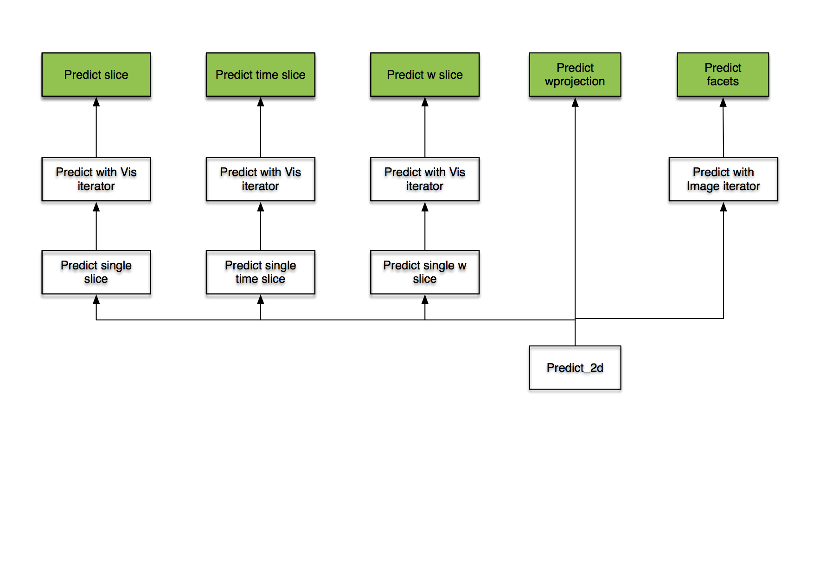
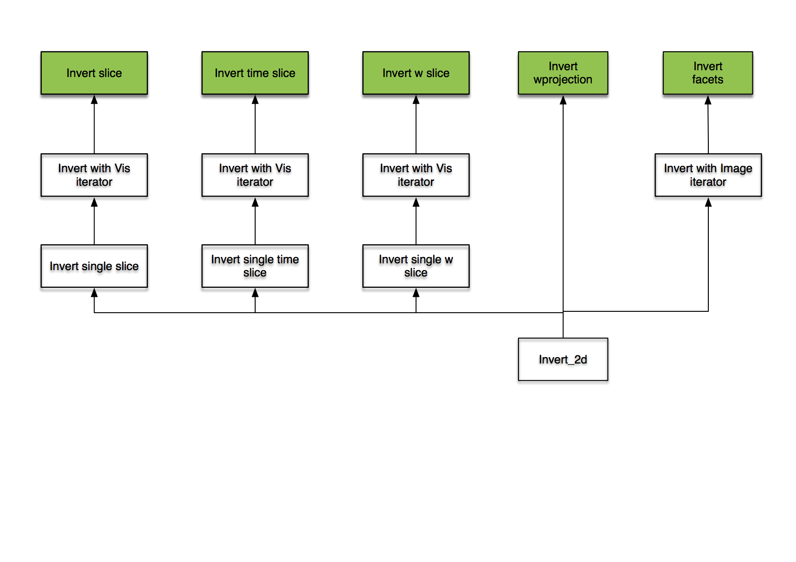
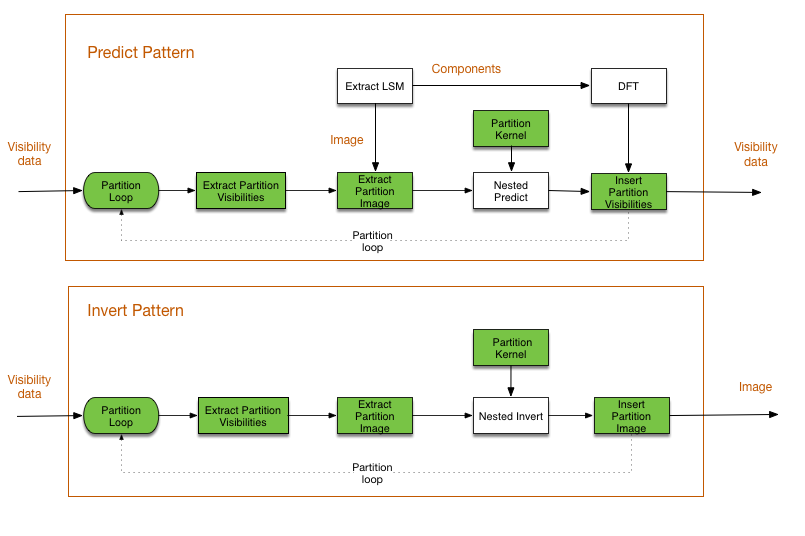

.. Fourier processing

Fourier processing
******************

Imaging functionality is in the module :py:mod:`arl.imaging.base` . Graphs providing processing using these functions
are in the module :py:mod:`arl.graphs.graphs` .

There are many algorithms for imaging, using different approaches to correct for various effects:

+ Simple 2D transforms
+ Partitioned image (i.e. faceted) and uv transforms
+ W projection
+ W snapshots
+ W slices
+ A projection variants
+ Visibility coalescence and de-coalescence
+ MFS variants

Since the scale of SKA is so much larger than previous telescopes, it is not clear which scaling strategies and
algorithms are going to offer the best performance. For this reason, it is important the synthesis framework not be
restrictive.

All the above functions are linear in the visibilities and image. The 2D transform is correct for sufficiently
restricted context. Hence we will layer all algorithms on top of the 2D transform. This means that a suitable
framework decomposes the overall transform into suitable linear combinations of invocations of 2D transforms. We can
use python iterators to perform the subsectioning. For example, the principal image iteration via a raster
implemented by a python generator::

        m31model=create_test_image()
        for ipatch in raster(m31model, nraster=2):
            # each image patch can be used to add to the visibility data
            vis + = predict_2d(vis, ipatch, params)

        # For image partitioning and snapshot processing
        iraster, interval = find_optimum_iraster_times(vis, model)
        m31model=create_test_image()
        for ipatch in raster(m31model, nraster=iraster):
            for subvis in snapshot(vis, interval=interval):
                # each patch can be used to add to the visibility data
                subvis + = predict_2d(subvis, ipatch, params)

This relies upon the data objects (model and vis) possessing sufficient meta data to enable operations such as phase
rotation from one frame to another.

The Visibility API supports these forms of iteration.

The layering of predict and invert classes is shown below:

The top level functions are in green. All capability is therefore layered on two functions, predict_2d and invert_2d.

Another view is shown next:

In ARL, the primary functionality for bringing together the calibration and imaging capabilities is via the graphs
at :py:mod:`arl.graphs.graphs`. Iteration is not well suited to graph processing, so for making calibration and
imaging graphs the iterators have been wrapped as scatter/gather operations that may be used to construct the graphs
before execution.

The visibility data can be scatter/gathered by timeslice and w. Images may be scatter/gathered via rasters.

To enable efficient graph processing, the units of processing are kept small. Each should be doable in a few minutes.

