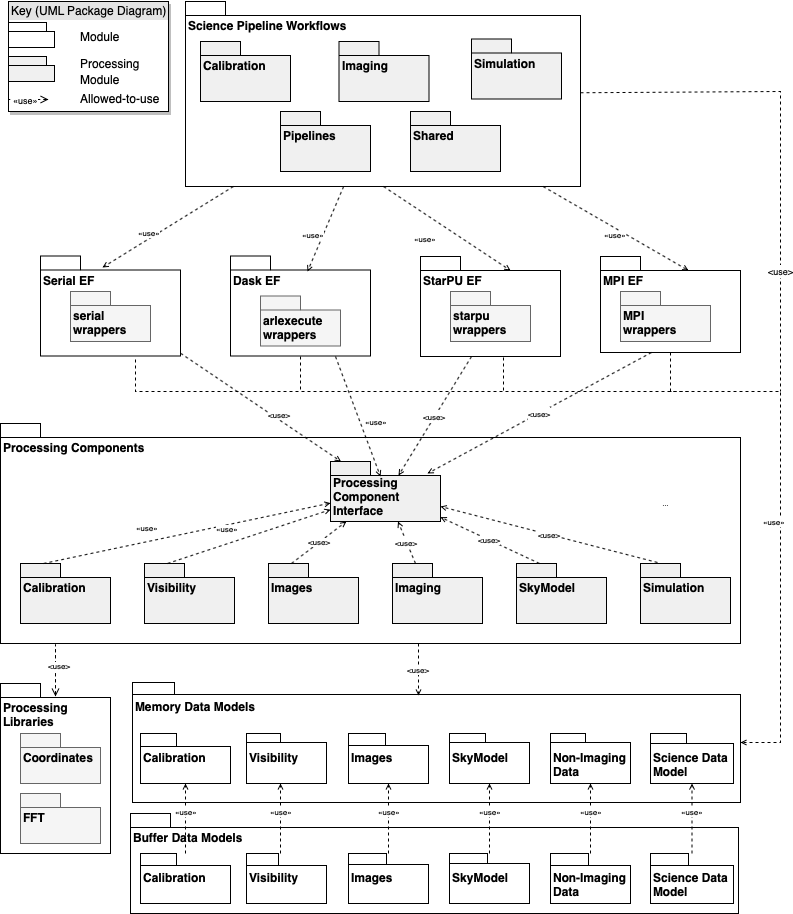

.. Documentation master

The role of the Algorithm Reference Library in SDP
**************************************************

ARL was developed as part of the SKA SDP consortium work. For an overview of the SDP see the `SDP CDR
documentation <http://ska-sdp.org/publications/sdp-cdr-closeout-documentation>`_

The ARL structure maps that used in the SDP processing architecture:

For clarity, not all connections are shown in this diagram.

More details can be found at: `SKA1 SDP Algorithm Reference Library (ARL) Report <http://ska-sdp.org/sites/default/files/attachments/ska-tel-sdp-0000150_02_sdparlreport_part_1_-_signed.pdf>`_

* :ref:`modindex`
* :ref:`genindex`
* :ref:`search`

