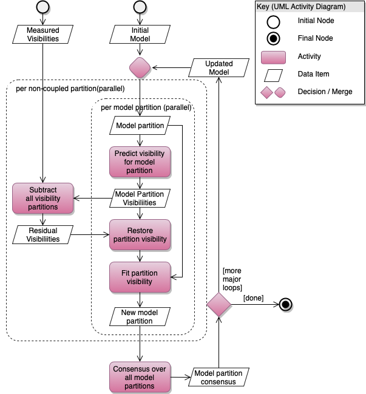

.. Calibration

.. toctree::
   :maxdepth: 3

Calibration
***********

Calibration is performed by fitting observed visibilities to a model visibility. The least squares fit algorithm uses
   an iterative substitution (or relaxation) algorithm from Larry D'Addario in the late seventies.

The equation to be minimised is:

.. math:: S = \sum_{t,f}^{}{\sum_{i,j}^{}{w_{t,f,i,j}\left| V_{t,f,i,j}^{\text{obs}} - J_{i}{J_{j}^{*}V}_{t,f,i,j}^{\text{mod}} \right|}^{2}}

Calibration control is via the :py:mod:`arl.calibration.calibration_context`. This supports the following Jones
   matrices::

   . T - Atmospheric phase
   . G - Electronics gain
   . P - Polarisation
   . B - Bandpass
   . I - Ionosphere

This is specified via a dictionary::

    contexts = {'T': {'shape': 'scalar', 'timeslice': 'auto', 'phase_only': True, 'first_iteration': 0},
                'G': {'shape': 'vector', 'timeslice': 60.0, 'phase_only': False, 'first_iteration': 0},
                'P': {'shape': 'matrix', 'timeslice': 1e4, 'phase_only': False, 'first_iteration': 0},
                'B': {'shape': 'vector', 'timeslice': 1e5, 'phase_only': False, 'first_iteration': 0},
                'I': {'shape': 'vector', 'timeslice': 1.0, 'phase_only': True, 'first_iteration': 0}}

Model Partition Calibration
***************************

Model Partition Calibration is inspired by the paper:

Radio interferometric calibration with SAGE, S Kazemi, S Yatawatta, S Zaroubi, P Lampropoulos, A G de Bruyn, L V E
Koopmans, and J Noordam, Monthly Notices of the Royal Astronomical Society, 2011 vol. 414 (2) pp. 1656-1666.

In this code:

- A single modelpartition is taken to be a vector composed of skycomponent, gaintable tuples.

- The E step for a specific window is the sum of the window data model and the discrepancy between the observed data
and the summed modelpartitions.

- The M step for a specific window is the optimisation of the skymodel vector given the window data model. This involves fitting a skycomponent and fitting for the gain phases.

To run modelpartition, you must provide a visibility dataset and a set of skycomponents. The output will be the model
parameters (component and gaintable for all skycomponents), and the residual visibility.

modelpartition works best if an initial phase calibration has been obtained using an isoplanatic approximation.