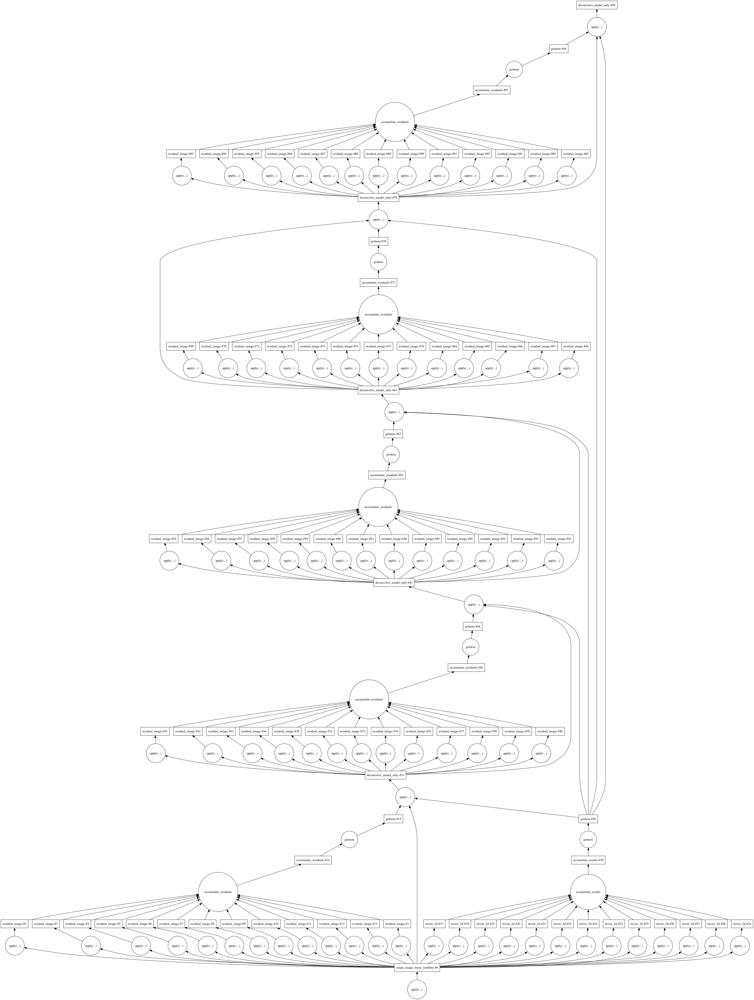

ARL and DASK
************

Dask is a python package for distributed processing:

    http://dask.pydata.org/en/latest/

    https://github.com/dask/dask-tutorial

Running ARL and Dask on a single machine is very straightforward. First define a graph and then compute it either by
calling the compute method of the graph or by passing the graph to a dask client.

A typical graph will flow from a set of input visibility sets to an image or set of images. In the course
of constructing a graph, we will need to know the data elements and the functions transforming brtween them.
These are well-modeled in ARL. A example of three cycles of a major/minor cycle deconvolutions is shown below:

Conceptually we can think of one visibility set, which may be decomposed into different subsets in processing, and
one image, which also may be subsetted for processing.

Dask is supported in various ways:

    - :py:mod:`arl.graphs.graphs`: Graphs to perform various types of prediction and inversion of visibility data
    - :py:mod:`arl.graphs.generic_graphs`: Graphs to perform generic image or visibility unary operations
    - :py:mod:`arl.util.graph_support`: Graphs to support testing and simulations
    - :py:mod:`arl.pipelines.graphs`: Graphs to implement the canonical pipelines

In addition there are notebooks in examples/arl.

    - imaging-dask: General imaging example
    - imaging-pipelines: Pipelines run on small LOW observation (core only)
    - calibration-pipelines: Pipelines for self-calibration

There are supporting functions for scatter/gather of some of the appropriate data models.

These notebooks are scaled to run on a 2017-era laptop (4 cores, 16GB) but can be changed to larger scales. Both
explicitly create a client and output the URL (usually http://127.0.0.1:8787) for the Dask diagnostics. Of these the
status page is most useful. If you shrink the browser size enough laterally all of the information appears on one
page. Below is a snapshot of the diagnostic page when dask is calculating an image:

.. image:: partial.png
      :width: 1024px

Using ARL and dask on Darwin
****************************

Running on a cluster is quite a bit more complicated, mostly because of the ways that clusters are operated. Darwin
uses SLURM for scheduling. There is python binding of DRMAA that could in principle be used to queue the processing.
However in the end, a simple edited job submission script was sufficient.

After quite a bit of experimentation I decided to avoid a virtual environment because of apparent problems using
those on worker nodes.

* PATH=~/python/bin:$PATH
* cd $ARL; pip install --prefix=~/python -r requirements.txt
* pip install --prefix=~/python paramiko

Ensure that the .bashrc file has the same definition as .bash_profile. If not, ssh will give strange errors! The
PYTHONPATH should look like::

    $ echo $PYTHONPATH
    /home/hpccorn1/Code/algorithm-reference-library:/home/hpccorn1/arlenv/lib/python3.5/site-packages

You can start a scheduler and workers by hand. Set the environment variable ARL_DASK_SCHEDULER appropriately::

    export ARL_DASK_SCHEDULER=192.168.2.10:8786

If you do this, remember to start the workers as well. dask-ssh is useful for this::

    c=get_dask_Client(timeout=30)
    c.scheduler_info()

get_dask_Client will look for a scheduler via the environment variable ARL_DASK_SCHEDULER. It that does not exist, it
 will start a Client using the default Dask approach.

On darwin, each node has 16 cores, and each core has 4GB. Usually this is insufficient for ARL and so some cores must be
 not used so the memory can be used by other cores. To run 7 workers and one scheduler on 4 nodes, the SLURM batch
 file should look something like::

    #!/bin/bash
    #!
    #! Dask job script for Darwin (Sandy Bridge, ConnectX3)
    #! Tim Cornwell
    #!

    #!#############################################################
    #!#### Modify the options in this section as appropriate ######
    #!#############################################################

    #! sbatch directives begin here ###############################
    #! Name of the job:
    #SBATCH -J SDP_ARL
    #! Which project should be charged:
    #SBATCH -A SKA-SDP
    #! How many whole nodes should be allocated?
    #SBATCH --nodes=4
    #! How many (MPI) tasks will there be in total? (<= nodes*16)
    #SBATCH --ntasks=8
    #! How much wallclock time will be required?
    #SBATCH --time=00:10:00
    #! What types of email messages do you wish to receive?
    #SBATCH --mail-type=FAIL
    #! Uncomment this to prevent the job from being requeued (e.g. if
    #! interrupted by node failure or system downtime):
    ##SBATCH --no-requeue

    #! Do not change:
    #SBATCH -p sandybridge

    #! sbatch directives end here (put any additional directives above this line)

    #! Notes:
    #! Charging is determined by core number*walltime.

    #! ############################################################
    #! Modify the settings below to specify the application's environment, location
    #! and launch method:

    #! Optionally modify the environment seen by the application
    #! (note that SLURM reproduces the environment at submission irrespective of ~/.bashrc):
    . /etc/profile.d/modules.sh                # Leave this line (enables the module command)
    module purge                               # Removes all modules still loaded
    module load default-impi                   # REQUIRED - loads the basic environment

    #! Set up python
    echo -e "Running python: `which python`"
    . $HOME/arlenv/bin/activate
    export PYTHONPATH=$PYTHONPATH:$ARL
    echo "PYTHONPATH is ${PYTHONPATH}"
    module load python
    echo -e "Running python: `which python`"
    echo -e "Running dask-scheduler: `which dask-scheduler`"

    #! Work directory (i.e. where the job will run):
    workdir="$SLURM_SUBMIT_DIR"  # The value of SLURM_SUBMIT_DIR sets workdir to the directory
                                 # in which sbatch is run.

    #! Are you using OpenMP (NB this is unrelated to OpenMPI)? If so increase this
    #! safe value to no more than 16:
    export OMP_NUM_THREADS=1

    #CMD="jupyter nbconvert --execute --ExecutePreprocessor.timeout=3600 --to rst simple-dask.ipynb"
    #CMD="python dask_minimal.py"
    CMD="python3 imaging-distributed.py"

    cd $workdir
    echo -e "Changed directory to `pwd`.\n"

    JOBID=$SLURM_JOB_ID

    if [ "$SLURM_JOB_NODELIST" ]; then
            #! Create a hostfile:
            export NODEFILE=`generate_pbs_nodefile`
            cat $NODEFILE | uniq > hostfile.$JOBID
            echo -e "\nNodes allocated:\n================"
            echo `cat hostfile.$JOBID | sed -e 's/\..*$//g'`
    fi

    echo -e "JobID: $JOBID\n======"
    echo "Time: `date`"
    echo "Master node: `hostname`"
    echo "Current directory: `pwd`"

    # dask-worker --preload distributed_setup.py $scheduler &
    scheduler="`hostname`:8786"
    echo "About to dask-ssh on:"
    cat hostfile.$JOBID

    #! dask-ssh related options:
    #!  --nthreads INTEGER        Number of threads per worker process. Defaults to
    #!                            number of cores divided by the number of processes
    #!                            per host.
    #!  --nprocs INTEGER          Number of worker processes per host.  Defaults to
    #!                            one.
    #!  --hostfile PATH           Textfile with hostnames/IP addresses
    #!
    dask-ssh --nprocs 2 --nthreads 1 --scheduler-port 8786 --log-directory `pwd` --hostfile hostfile.$JOBID &
    sleep 10

    #! We need to tell dask Client (inside python) where the scheduler is running
    scheduler="`hostname`:8786"
    echo "Scheduler is running at ${scheduler}"
    export ARL_DASK_SCHEDULER=${scheduler}

    echo "About to execute $CMD"

    eval $CMD

    #! Wait for dash-ssh to be shutdown from the python
    wait %1

In the command CMD remember to shutdown the Client so the batch script will close the background dask-ssh and then exit.

Thw diagnostic pages can be tunneled. ARL emits the URL of the diagnostic page. For example::

      http://10.143.1.25:8787

Then to tunnel the pages::

      ssh hpccorn1@login.hpc.cam.ac.uk -L8080:10.143.1.25:8787

The diagnostic page is available from your local browser at::

      127.0.0.1:8080

Using ARL and dask on P3
************************

[To be written]

