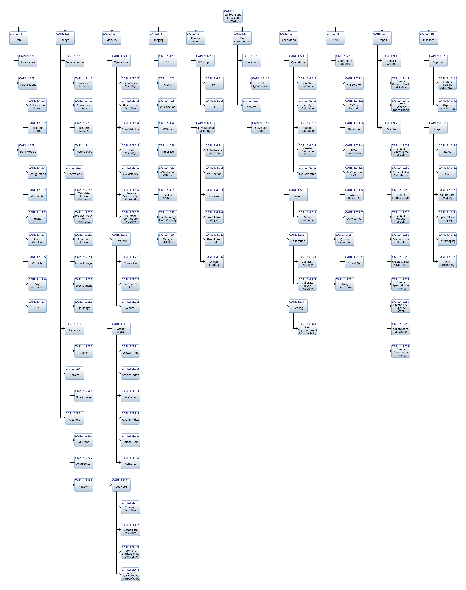

.. toctree::
   :maxdepth: 2

ARL definition
**************

ARL is composed of data models and functions. The data models are implemented as python classes. The functions are
stateless so calling the same function with the same inputs will always return the same value.

Please note that the documentation below has links to the python source. In the end, this is the definitive
documentation.

Functional Model
================

The top-level functional model corresponds to the major SDP pipelines:

.. image:: ./ARL_functional.png
   :scale: 100 %

ARL API
=======

The data structures are operated on by state-less functions. The complete set of functions is:

Data
----

Data models
+++++++++++

.. automodule:: arl.data.data_models
   :members:

Parameter handling
++++++++++++++++++

.. automodule:: arl.data.parameters
   :members:

Polarisation
++++++++++++

.. automodule:: arl.data.polarisation
   :members:

Image
-----

Operations
++++++++++

.. automodule:: arl.image.operations
   :members:

Gather/Scatter
++++++++++++++

.. automodule:: arl.image.gather_scatter
   :members:

Iterators
+++++++++

.. automodule:: arl.image.iterators
   :members:

Deconvolution
+++++++++++++

.. automodule:: arl.image.deconvolution
   :members:

Cleaners
++++++++

.. automodule:: arl.image.cleaners
   :members:

Solvers
+++++++

.. automodule:: arl.image.solvers
   :members:

Calibration
-----------

Calibration
+++++++++++

.. automodule:: arl.calibration.calibration
   :members:

Operations
++++++++++

.. automodule:: arl.calibration.operations
   :members:

Peeling
+++++++

.. automodule:: arl.calibration.peeling
   :members:

Solvers
+++++++

.. automodule:: arl.calibration.solvers
   :members:

Fourier transform
-----------------

FFT support
+++++++++++

.. automodule:: arl.fourier_transforms.fft_support
   :members:

Convolutional Gridding
++++++++++++++++++++++

.. automodule:: arl.fourier_transforms.convolutional_gridding
   :members:

Imaging
-------

Base
++++

.. automodule:: arl.imaging.base
   :members:

Facets
++++++

.. automodule:: arl.imaging.facets
   :members:

Facets and Wstack
+++++++++++++++++

.. automodule:: arl.imaging.facets_wstack
   :members:

Timeslice
+++++++++

.. automodule:: arl.imaging.timeslice
   :members:

Wprojection
+++++++++++

.. automodule:: arl.imaging.wprojection
   :members:

Wprojection and Wstack
++++++++++++++++++++++

.. automodule:: arl.imaging.wprojection_wstack
   :members:

Wstack
++++++

.. automodule:: arl.imaging.wstack
   :members:

Parameters
++++++++++

.. automodule:: arl.imaging.params
   :members:

Iterated
++++++++

.. automodule:: arl.imaging.iterated
   :members:

Skycomponent
------------

Operations
++++++++++

.. automodule:: arl.skycomponent.operations
   :members:

Visibility
----------

Base
++++

.. automodule:: arl.visibility.base
   :members:

Operations
++++++++++

.. automodule:: arl.visibility.operations
   :members:

Coalesce
++++++++

.. automodule:: arl.visibility.coalesce
   :members:

Gather/Scatter
++++++++++++++

.. automodule:: arl.visibility.gather_scatter
   :members:

Iterators
+++++++++

.. automodule:: arl.visibility.iterators
   :members:

Util
----

Array Functions
+++++++++++++++

.. automodule:: arl.util.array_functions
   :members:

Coordinate Support
++++++++++++++++++

.. automodule:: arl.util.coordinate_support
   :members:

Graph support
+++++++++++++

.. automodule:: arl.util.graph_support
   :members:

Quality assessment
++++++++++++++++++

.. automodule:: arl.util.quality_assessment
   :members:

Testing Support
+++++++++++++++

.. automodule:: arl.util.testing_support
   :members:

Timing
++++++

.. automodule:: arl.util.timing
   :members:

Graphs
------

Dask Graphs
+++++++++++

.. automodule:: arl.graphs.graphs
   :members:

Generic Dask Graphs
+++++++++++++++++++

.. automodule:: arl.graphs.generic_graphs
   :members:

Dask init
+++++++++

.. automodule:: arl.graphs.dask_init
   :members:

Vis
+++

.. automodule:: arl.graphs.vis
   :members:

Pipelines
---------

Pipeline Graphs
+++++++++++++++

.. automodule:: arl.pipelines.graphs
   :members:

Functions
+++++++++

.. automodule:: arl.pipelines.functions
   :members:

Support
+++++++

.. automodule:: arl.pipelines.support
   :members:

Unit tests
**********

Unit tests written in standard python style are available.

.. automodule:: tests.test_array_functions
   :members:
   :undoc-members:

.. automodule:: tests.test_calibration_operations
   :members:
   :undoc-members:

.. automodule:: tests.test_calibration_peeling
   :members:
   :undoc-members:

.. automodule:: tests.test_calibration_solvers
   :members:
   :undoc-members:

.. automodule:: tests.test_convolutional_gridding
   :members:
   :undoc-members:

.. automodule:: tests.test_coordinate_support
   :members:
   :undoc-members:

.. automodule:: tests.test_fft_support
   :members:
   :undoc-members:

.. automodule:: tests.test_generic_graph
   :members:
   :undoc-members:

.. automodule:: tests.test_graph_support
   :members:
   :undoc-members:

.. automodule:: tests.test_graphs
   :members:
   :undoc-members:

.. automodule:: tests.test_image_deconvolution
   :members:
   :undoc-members:

.. automodule:: tests.test_image_deconvolution_msmfs
   :members:
   :undoc-members:

.. automodule:: tests.test_image_gather_scatter
   :members:
   :undoc-members:

.. automodule:: tests.test_image_iterators
   :members:
   :undoc-members:

.. automodule:: tests.test_image_msclean
   :members:
   :undoc-members:

.. automodule:: tests.test_image_operations
   :members:
   :undoc-members:

.. automodule:: tests.test_image_solvers
   :members:
   :undoc-members:

.. automodule:: tests.test_imaging
   :members:
   :undoc-members:

.. automodule:: tests.test_imaging_params
   :members:
   :undoc-members:

.. automodule:: tests.test_parameters
   :members:
   :undoc-members:

.. automodule:: tests.test_pipelines
   :members:
   :undoc-members:

.. automodule:: tests.test_pipelines_graphs
   :members:
   :undoc-members:

.. automodule:: tests.test_polarisation
   :members:
   :undoc-members:

.. automodule:: tests.test_quality_assessment
   :members:
   :undoc-members:

.. automodule:: tests.test_skycomponent
   :members:
   :undoc-members:

.. automodule:: tests.test_testing_support
   :members:
   :undoc-members:

.. automodule:: tests.test_visibility_coalesce
   :members:
   :undoc-members:

.. automodule:: tests.test_visibility_iterators
   :members:
   :undoc-members:

.. automodule:: tests.test_visibility_operations
   :members:
   :undoc-members:

