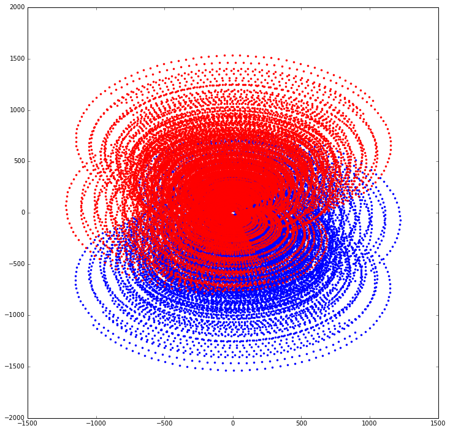
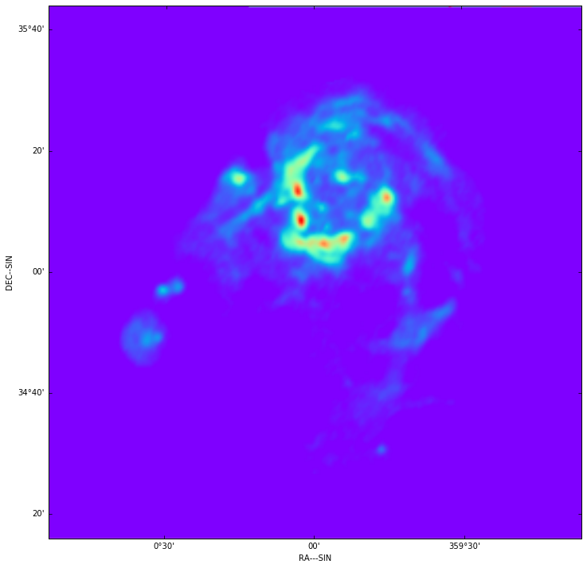
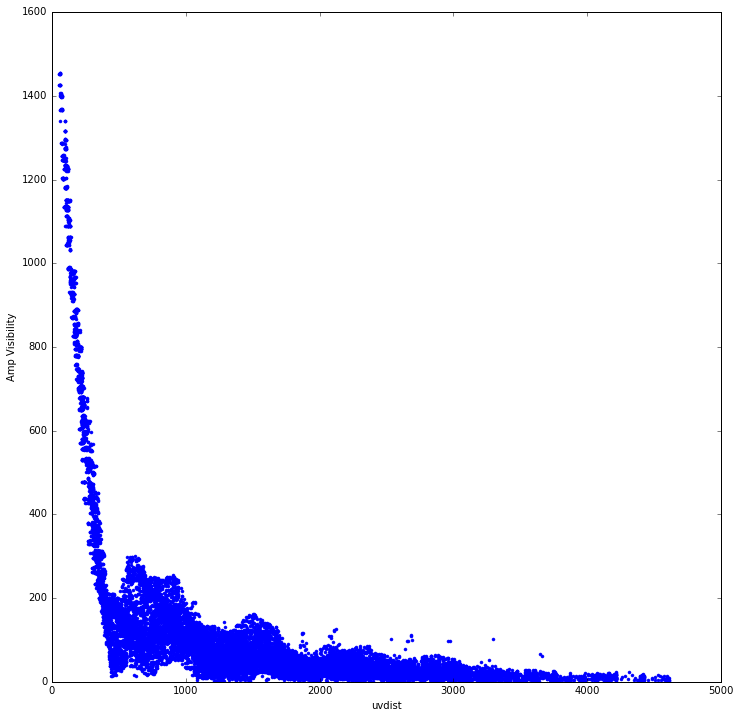
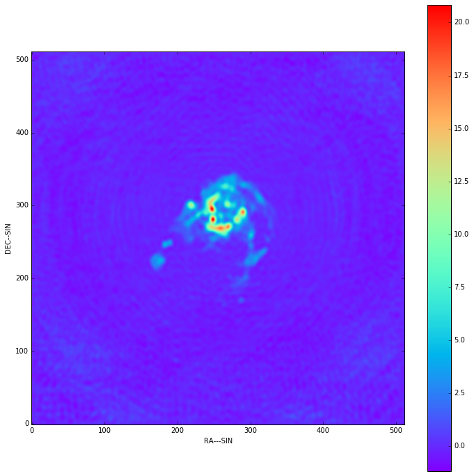
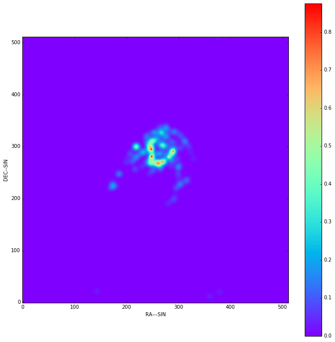
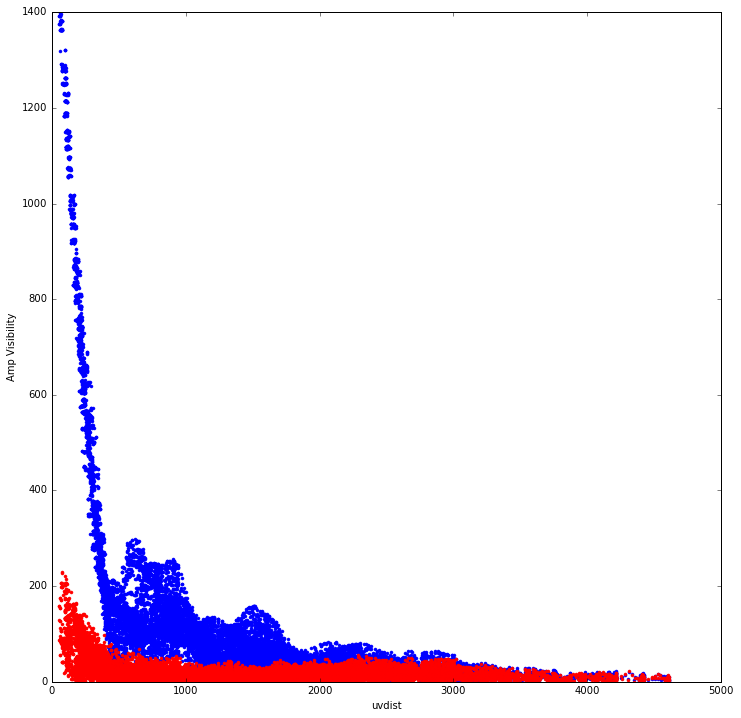

Imaging notebook
================

This notebook works through the high level functions interface to
crocodile, making a fake data set and then deconvolving it. Finally the
full and residual visibility are plotted.

.. code:: python

    %matplotlib inline
    
    import sys, os 
    sys.path.append('../..') 
    print(os.getcwd())
    
    import pylab
    pylab.rcParams['figure.figsize'] = (12.0, 12.0)
    pylab.rcParams['image.cmap'] = 'rainbow'
    
    from astropy import constants as const
    from astropy import units as u
    from astropy.coordinates import SkyCoord, CartesianRepresentation, SkyOffsetFrame
    import scipy.special
    
    from matplotlib import pylab
    from matplotlib import pyplot as plt
    
    from arl.deconvolve import deconvolve
    from arl.visibility import create_visibility
    from arl.imaging import *
    from arl.skymodel import SkyModel, skymodel_from_image, skymodel_add_image, skymodel_add_component
    from arl.skycomponent import *
    from arl.image import image_show, image_from_fits, image_to_fits, image_replicate, point_source_find
    from arl.configuration import configuration_filter, named_configuration

.. parsed-literal::

    /Users/timcornwell/Code/crocodile/examples/arl

We construct a VLA configuration and then shrink it to match our test
image.

.. code:: python

    kwargs = {}
    
    vlaa = configuration_filter(named_configuration('VLAA'), **kwargs)
    vlaa.data['xyz']=vlaa.data['xyz']/10.0

.. parsed-literal::

    Configuration: No filter implemented yet

We create the visibility. This just makes the uvw, time, antenna1,
antenna2, weight columns in a table

.. code:: python

    times = numpy.arange(-numpy.pi/2.0, +numpy.pi/2.0,0.05)
    frequency = numpy.array([1e8])
    
    reffrequency = numpy.max(frequency)
    phasecentre = SkyCoord(0.0*u.rad, u.rad*numpy.pi/4, frame='icrs', equinox=2000.0)
    vt = create_visibility(vlaa, times, frequency, weight=1.0, phasecentre=phasecentre)

.. parsed-literal::

    visibility.create_visibility: Created 22113 rows

Plot the synthesized uv coverage, including for MFS

.. code:: python

    plt.clf()
    for f in frequency:
        x=f/const.c
        plt.plot(x*vt.data['uvw'][:,0], x*vt.data['uvw'][:,1], '.', color='b')
        plt.plot(-x*vt.data['uvw'][:,0], -x*vt.data['uvw'][:,1], '.', color='r')

Read the venerable test image, constructing an image

.. code:: python

    m31image = image_from_fits("./data/models/M31.MOD")
    fig = plt.figure()
    cellsize=180.0*0.0001/numpy.pi
    m31image.wcs.wcs.cdelt[0]=-cellsize
    m31image.wcs.wcs.cdelt[1]=+cellsize
    m31image.wcs.wcs.radesys='ICRS'
    m31image.wcs.wcs.equinox=2000.00
    
    
    fig.add_subplot(111, projection=m31image.wcs)
    plt.imshow(m31image.data, origin='lower', cmap='rainbow')
    plt.xlabel('RA---SIN')
    plt.ylabel('DEC--SIN')
    plt.show()

.. parsed-literal::

    WARNING: VerifyWarning: Error validating header for HDU #1 (note: Astropy uses zero-based indexing).
        'ascii' codec can't decode byte 0x88 in position 0: ordinal not in range(128)
    There may be extra bytes after the last HDU or the file is corrupted. [astropy.io.fits.hdu.hdulist]
    WARNING: FITSFixedWarning: 'datfix' made the change 'Invalid parameter value: invalid date ' 26/09/8''. [astropy.wcs.wcs]

.. parsed-literal::

    image_from_fits: Max, min in /Users/timcornwell/Code/crocodile//./data/models/M31.MOD = 1.006458, -0.000000

.. code:: python

    from astropy.wcs.utils import skycoord_to_pixel, pixel_to_skycoord
    wall = m31image.wcs
    wall.wcs.radesys='ICRS'
    wall.wcs.equinox=2000.00
    print(wall.wcs.radesys)
    print(wall.wcs.equinox)
    sc=pixel_to_skycoord(128, 128, wall, 1, 'wcs')
    print(sc)
    pixloc = skycoord_to_pixel(SkyCoord("-1.0d", "37.0d", frame='icrs', equinox=2000.0), wall, 1)
    print(pixloc)
    scrt = pixel_to_skycoord(pixloc[0], pixloc[1], wall, 1, 'wcs')
    print(scrt)

.. parsed-literal::

    ICRS
    2000.0
    <SkyCoord (ICRS): (ra, dec) in deg
        (0.0, 35.0)>
    (array(267.38111516593335), array(477.69264278296))
    <SkyCoord (ICRS): (ra, dec) in deg
        (359.0, 37.0)>

.. code:: python

    sof=sc.skyoffset_frame()

This image is only 2 dimensional. We need extra axes frequency and
stokes.

.. code:: python

    m31image4D=image_replicate(m31image, shape=[1, 1, 4, len(frequency)])
    m31sm = skymodel_from_image(m31image4D)

.. parsed-literal::

    image_replicate: replicating shape (256, 256) to (1, 4, 256, 256)
    WCS Keywords
    
    Number of WCS axes: 2
    CTYPE : 'RA---SIN'  'DEC--SIN'  
    CRVAL : 0.0  35.0  
    CRPIX : 128.0  128.0  
    NAXIS    : 256 256

Add some SkyComponents

.. code:: python

    comp1=create_skycomponent(direction=SkyCoord("05d00m00.0s", "02d00m0.0s"), flux=numpy.array([[1.0,0.0,0.0,0.0]]), 
                       frequency=frequency)
    m31sm=skymodel_add_component(m31sm, comp1)

Now we can predict the visibility from this model

.. code:: python

    kwargs={'wstep':100.0, 'npixel':256, 'cellsize':0.0001}
    vt = predict(vt, m31sm, **kwargs)

.. parsed-literal::

    imaging.wcs_from_visibility: Parsing kwargs to get definition of WCS
    imaging.wcs_from_visibility: Defining Image at <SkyCoord (ICRS): (ra, dec) in deg
        (0.0, 45.0)>, frequency 100000000.0 Hz, and bandwidth 100000000.0 Hz
    imaging.wcs_from_visibility: uvmax = 1533.754509 lambda
    imaging.wcs_from_visibility: Critical cellsize = 0.000326 radians, 0.018678 degrees
    imaging.wcs_from_visibility: Cellsize          = 0.000100 radians, 0.005730 degrees
    imaging.predict: Predicting Visibility from sky model images
    imaging.predict: Image cellsize 0.000100 radians
    imaging.predict: Field of view 0.025600 radians
    imaging.predict: Making w-kernel cache of 12 kernels
    imaging.predict: Predicting from image channel 0, polarisation 0
    imaging.predict: Predicting from image channel 0, polarisation 1
    imaging.predict: Predicting from image channel 0, polarisation 2
    imaging.predict: Predicting from image channel 0, polarisation 3
    imaging.predict: Finished predicting Visibility from sky model images
    imaging.predict: Predicting Visibility from sky model components
    imaging.predict: Cartesian representation of component 0 = (0.995588, 0.087103, 0.034899)
    imaging.predict: Predicting from component 0 channel 0, polarisation 0
    imaging.predict: Predicting from component 0 channel 0, polarisation 1
    imaging.predict: Predicting from component 0 channel 0, polarisation 2
    imaging.predict: Predicting from component 0 channel 0, polarisation 3
    imaging.predict: Finished predicting Visibility from sky model components

To check that we got it right, plot the amplitude of the visibility.

.. code:: python

    uvdist=numpy.sqrt(vt.data['uvw'][:,0]**2+vt.data['uvw'][:,1]**2)
    plt.clf()
    plt.plot(uvdist, numpy.abs(vt.data['vis'][:,0,0]), '.')
    plt.xlabel('uvdist')
    plt.ylabel('Amp Visibility')
    plt.show()

Make the dirty image and point spread function

.. code:: python

    kwargs={}
    kwargs['npixel']=512
    kwargs['cellsize']=0.0001
    kwargs['wstep']=30.0
    dirty, psf, sumwt = invert(vt, **kwargs)
    image_show(dirty)
    print("Max, min in dirty image = %.6f, %.6f, sum of weights = %f" % (dirty.data.max(), dirty.data.min(), sumwt))
    
    print("Max, min in PSF         = %.6f, %.6f, sum of weights = %f" % (psf.data.max(), psf.data.min(), sumwt))
    
    image_to_fits(dirty, 'dirty.fits')
    image_to_fits(psf, 'psf.fits')
    m31compnew = point_source_find(dirty, **kwargs)

.. parsed-literal::

    imaging.invert: Inverting Visibility to make dirty and psf
    imaging.wcs_from_visibility: Parsing kwargs to get definition of WCS
    imaging.wcs_from_visibility: Defining Image at <SkyCoord (ICRS): (ra, dec) in deg
        (0.0, 45.0)>, frequency 100000000.0 Hz, and bandwidth 100000000.0 Hz
    imaging.wcs_from_visibility: uvmax = 1533.754509 lambda
    imaging.wcs_from_visibility: Critical cellsize = 0.000326 radians, 0.018678 degrees
    imaging.wcs_from_visibility: Cellsize          = 0.000100 radians, 0.005730 degrees
    imaging.invert: Specified npixel=512, cellsize = 0.000100 rad, FOV = 0.051200 rad
    imaging.invert: Making w-kernel cache of 39 kernels
    imaging.invert: Inverting channel 0, polarisation 0
    imaging.invert: Inverting channel 0, polarisation 1
    imaging.invert: Inverting channel 0, polarisation 2
    imaging.invert: Inverting channel 0, polarisation 3
    imaging.invert: Finished making dirty and psf
    Max, min in dirty image = 20.858104, -1.150472, sum of weights = 0.038254
    Max, min in PSF         = 1.000000, -0.111255, sum of weights = 0.038254
    imaging.point_source_find: Finding components in Image
    imaging.point_source_find: Found peak at pixel coordinates [  0   2 281 248]
    imaging.point_source_find: Found peak at world coordinates <SkyCoord (ICRS): (ra, dec) in deg
        (0.06498543, 45.14322122)>
    imaging.point_source_find: Flux is [[ 20.85441456  20.84613299  20.85810395  20.84613299]]

.. code:: python

    kwargs={'niter':100, 'threshold':0.001, 'fracthresh':0.01}
    comp, residual = deconvolve(dirty, psf, **kwargs)

.. parsed-literal::

    clean.clean: Processing pol 0, channel 0
    Peak of PSF = 1.0 at (256, 256)
    Peak of Dirty = 20.8544145565 at (281, 248)
    Coupling matrix =
     [[ 1.          0.98254714  0.76027592  0.19824986]
     [ 0.98254714  0.96555194  0.74886582  0.19720193]
     [ 0.76027592  0.74886582  0.60082915  0.18228196]
     [ 0.19824986  0.19720193  0.18228196  0.10628513]]
    Max abs in dirty Image = 20.854415
    Start of minor cycle
    This minor cycle will stop at 100 iterations or peak < 0.208544145565
    Minor cycle 0, peak [ 17.17797575  17.11536467  16.25758005  12.34458622] at [268, 260, 3]
    Minor cycle 10, peak [ 7.64043702  7.60799231  7.16590603  5.4673393 ] at [326, 267, 3]
    Minor cycle 20, peak [ 4.14116078  4.12215284  3.86464977  2.88518751] at [280, 218, 3]
    Minor cycle 30, peak [ 4.27011326  4.24515851  3.87970263  1.94575087] at [247, 185, 3]
    Minor cycle 40, peak [ 3.0363207   3.01519863  2.72668914  1.58108298] at [336, 264, 3]
    Minor cycle 50, peak [ 2.31747841  2.30096778  2.07785376  1.2180931 ] at [247, 299, 3]
    Minor cycle 60, peak [ 1.29442422  1.29667699  1.31423858  0.93643833] at [263, 284, 3]
    Minor cycle 70, peak [ 1.45144461  1.44815533  1.38676004  0.77235553] at [256, 265, 3]
    Minor cycle 80, peak [ 1.52273881  1.51263266  1.36841427  0.67674235] at [280, 203, 3]
    Minor cycle 90, peak [ 1.92605592  1.90622696  1.63462074  0.59406316] at [315, 235, 3]
    End of minor cycles
    clean.clean: Skipping pol 1, channel 0
    clean.clean: Skipping pol 2, channel 0
    clean.clean: Skipping pol 3, channel 0

.. code:: python

    fig=image_show(comp)
    fig=image_show(residual)

.. image:: imaging_files/imaging_23_0.png

.. code:: python

    kwargs={'wstep':30.0}
    vt = predict(vt, m31sm, **kwargs)
    modelsm=skymodel_from_image(comp)
    vtmodel = create_visibility(vlaa, times, frequency, weight=1.0, phasecentre=phasecentre)
    vtmodel.data = vt.data.copy()
    vtmodel=predict(vtmodel, modelsm,**kwargs)

.. parsed-literal::

    imaging.wcs_from_visibility: Parsing kwargs to get definition of WCS
    imaging.wcs_from_visibility: Defining Image at <SkyCoord (ICRS): (ra, dec) in deg
        (0.0, 45.0)>, frequency 100000000.0 Hz, and bandwidth 100000000.0 Hz
    imaging.wcs_from_visibility: uvmax = 1533.754509 lambda
    imaging.wcs_from_visibility: Critical cellsize = 0.000326 radians, 0.018678 degrees
    imaging.wcs_from_visibility: Cellsize          = 0.000163 radians, 0.009339 degrees
    imaging.predict: Predicting Visibility from sky model images
    imaging.predict: Image cellsize 0.000100 radians
    imaging.predict: Field of view 0.025600 radians
    imaging.predict: Making w-kernel cache of 39 kernels
    imaging.predict: Predicting from image channel 0, polarisation 0
    imaging.predict: Predicting from image channel 0, polarisation 1
    imaging.predict: Predicting from image channel 0, polarisation 2
    imaging.predict: Predicting from image channel 0, polarisation 3
    imaging.predict: Finished predicting Visibility from sky model images
    imaging.predict: Predicting Visibility from sky model components
    imaging.predict: Cartesian representation of component 0 = (0.995588, 0.087103, 0.034899)
    imaging.predict: Predicting from component 0 channel 0, polarisation 0
    imaging.predict: Predicting from component 0 channel 0, polarisation 1
    imaging.predict: Predicting from component 0 channel 0, polarisation 2
    imaging.predict: Predicting from component 0 channel 0, polarisation 3
    imaging.predict: Finished predicting Visibility from sky model components
    visibility.create_visibility: Created 22113 rows
    imaging.wcs_from_visibility: Parsing kwargs to get definition of WCS
    imaging.wcs_from_visibility: Defining Image at <SkyCoord (ICRS): (ra, dec) in deg
        (0.0, 45.0)>, frequency 100000000.0 Hz, and bandwidth 100000000.0 Hz
    imaging.wcs_from_visibility: uvmax = 1533.754509 lambda
    imaging.wcs_from_visibility: Critical cellsize = 0.000326 radians, 0.018678 degrees
    imaging.wcs_from_visibility: Cellsize          = 0.000163 radians, 0.009339 degrees
    imaging.predict: Predicting Visibility from sky model images
    imaging.predict: Image cellsize 0.000100 radians
    imaging.predict: Field of view 0.051200 radians
    imaging.predict: Making w-kernel cache of 39 kernels
    imaging.predict: Predicting from image channel 0, polarisation 0
    imaging.predict: Predicting from image channel 0, polarisation 1
    imaging.predict: Predicting from image channel 0, polarisation 2
    imaging.predict: Predicting from image channel 0, polarisation 3
    imaging.predict: Finished predicting Visibility from sky model images

Now we will plot the original visibility and the residual visibility.

.. code:: python

    uvdist=numpy.sqrt(vt.data['uvw'][:,0]**2+vt.data['uvw'][:,1]**2)
    plt.clf()
    plt.plot(uvdist, numpy.abs(vt.data['vis'][:,0,0]), '.', color='b')
    plt.plot(uvdist, numpy.abs(vt.data['vis'][:,0,0]-vtmodel.data['vis'][:,0,0]), '.', color='r')
    plt.xlabel('uvdist')
    plt.ylabel('Amp Visibility')
    plt.show()

