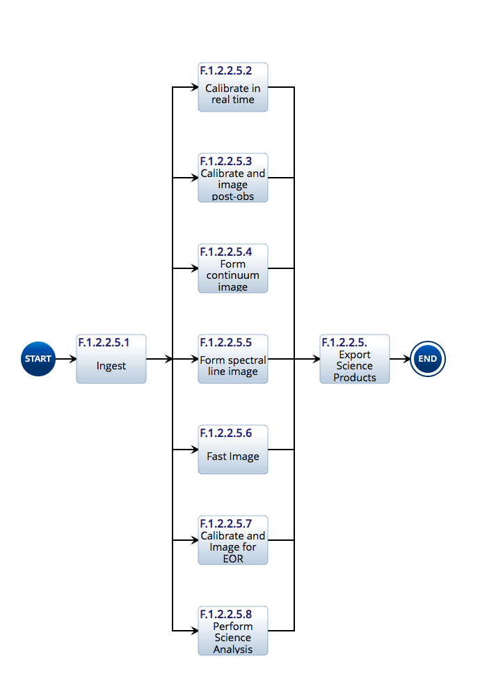
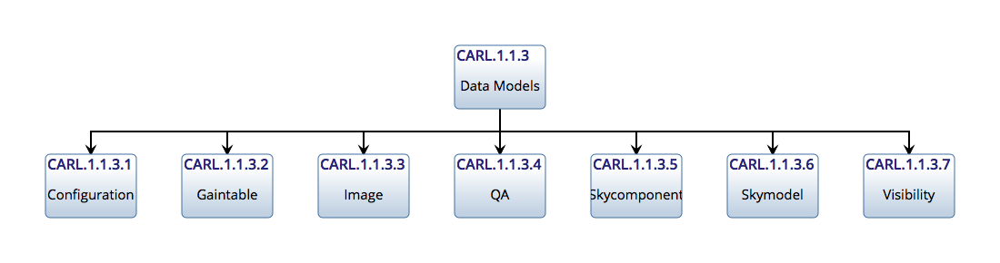
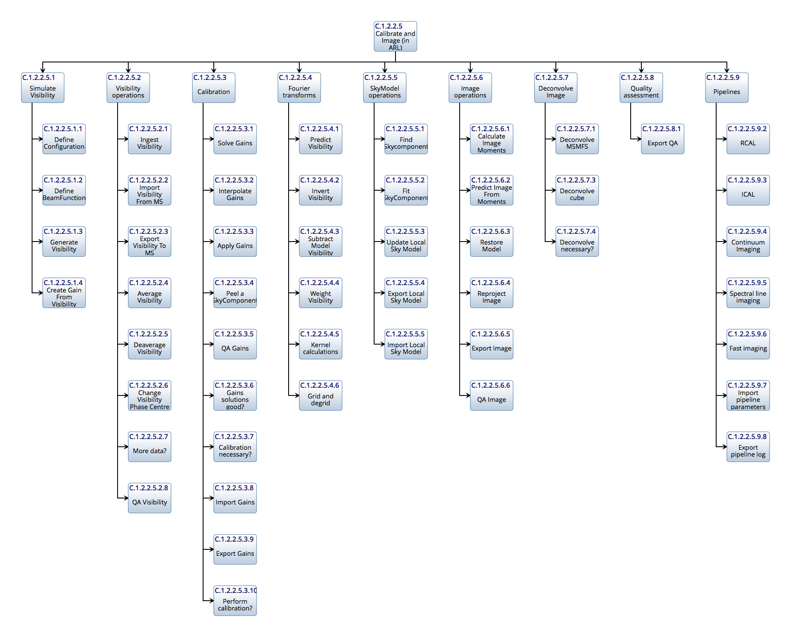

.. ARL documentation master file

:index:`Algorithm Reference Library`
************************************

The Algorithm Reference Library is used to capture radio interferometry calibration and imaging algorithms in a
reference form for use by SDP contractors. The interfaces all operate with familiar data structures such as image,
visibility table, gaintable, etc.

See also :doc:`Algorithm Reference Library Goals<arllib_goals>`

.. toctree::
   :name: mastertoc
   :maxdepth: 2

:index:`ARL-based Notebooks`
----------------------------

.. toctree::
   :name: mastertoc
   :maxdepth: 2

   Imaging Demonstration<arl/imaging>

:index:`Functional Model`
-------------------------

The functional model corresponds to the pipelines:

:index:`Data Models`
--------------------

The data models are:

.. automodule:: arl.data_models
   :members:

:index:`ARL API`
----------------

Data structures operated on by state-less components as follows:

All components possess an API which is always of the form::

      def processing_function(idatastruct1, idatastruct2, ..., processingparameters):
         return odatastruct1, odatastruct2,... other

Processing Parameters
+++++++++++++++++++++

Processing parameters are passed via a dictionary. Universal parameters can be set at the top level of the
dictionary. The parameters specific to a given function can stored in a field named by the function. For example::

   parameters = {'log': 'tims.log',
      'RCAL': {'visibility': self.visibility, 'skymodel': self.m31sm}
      'solve_gain': {'Gsolint': 300.0}}

   qa = RCAL(parameters}

Inside a function, the values are retrieved thus::

    log = get_parameter(params, 'log', None)
    vis = get_parameter(params, 'visibility', None)
    sm = get_parameter(params, 'skymodel', None)

The search for a keyword is first in the keys of parameters and then in parameters[functioname].

Function parameters should obey a consistent naming convention:

=======  =======
Name     Meaning
=======  =======
vis      Name of Visibility
sm       Name of SkyModel
sc       Name of Skycomponent
gt       Name of GainTable
conf     Name of Configuration
im       Name of input image
qa       Name of quality assessment
params   Name of processing parameters
log      Name of processing log
=======  =======

If a function argument has a better, more descriptive name e.g. normalised_gt, newphasecentre, use it.

Keyword=value pairs should have descriptive names. The names should be lower case with underscores to separate words:

====================    ==================================  ========================================================
Name                    Meaning                             Example
====================    ==================================  ========================================================
loop_gain               Clean loop gain                     0.1
niter                   Number of iterations                10000
eps                     Fractional tolerance                1e-6
threshold               Absolute threshold                  0.001
fractional_threshold    Threshold as fraction of e.g. peak  0.1
G_solution_interval     Solution interval for G term        100
phaseonly               Do phase-only solutions             True
phasecentre             Phase centre (usually as SkyCoord)  SkyCoord("-1.0d", "37.0d", frame='icrs', equinox=2000.0)
spectral_mode           Visibility processing mode          'mfs' or 'channel'
====================    ==================================  ========================================================

Parameter handling
++++++++++++++++++

.. automodule:: arl.parameters
   :members:

Visibility Operations
+++++++++++++++++++++

.. automodule:: arl.visibility_operations
   :members:

Visibility Calibration
++++++++++++++++++++++

.. automodule:: arl.visibility_calibration
   :members:

Fourier Transforms
++++++++++++++++++

.. automodule:: arl.fourier_transforms
   :members:

SkyModel operations
+++++++++++++++++++

.. automodule:: arl.skymodel_operations
   :members:

Image deconvolution
+++++++++++++++++++

.. automodule:: arl.image_deconvolution
   :members:

Image operations
++++++++++++++++

.. automodule:: arl.image_operations
   :members:

Polarisation
++++++++++++

.. automodule:: arl.polarisation
   :members:

Quality Assessment
++++++++++++++++++

.. automodule:: arl.quality_assessment
   :members:

Pipelines
+++++++++

.. automodule:: arl.pipelines
   :members:

Test Support
++++++++++++

.. automodule:: arl.test_support
   :members:

