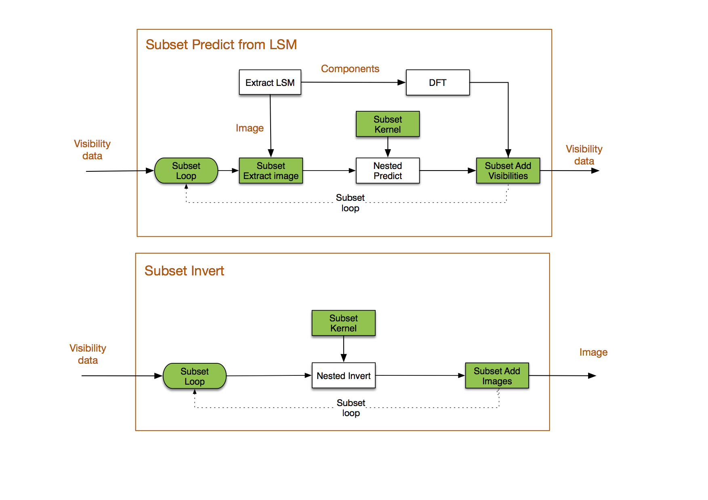

.. ARL documentation master file

.. toctree::
   :name: mastertoc
   :maxdepth: 2

:index:`Fourier processing`
***************************

Goals
-----

There are many algorithms for imaging, using different approaches to correct for various effects:

+ Simple 2D transforms
+ Partitioned image (i.e. faceted) and uv transforms
+ W projection
+ W snapshots
+ W slices
+ A projection variants
+ Visibility coalescence and de-coalescence
+ MFS variants

Approach
--------

All the above functions are linear in the visibilities and image. The 2D transform is correct for sufficiently
restricted context. Hence we will layer all algorithms on top of the 2D transform. This means that a suitable
framework decomposes the overall transform into suitable linear combinations of invocations of 2D transforms. We can
use python iterators to perform the subsectioning. For example, the principal image iteration via a raster
implemented by a python generator::

        m31model=create_test_image()
        for ipatch in raster(m31model, nraster=2):
            # each image patch can be used to add to the visibility data
            vis + = predict2d(vis, ipatch, params)

        # For image partitioning and snapshot processing
        iraster, interval = find_optimum_iraster_times(vis, model)
        m31model=create_test_image()
        for ipatch in raster(m31model, nraster=iraster):
            for subvis in snapshot(vis, interval=interval):
                # each patch can be used to add to the visibility data
                subvis + = predict2d(subvis, ipatch, params)

This relies upon the data objects (model and vis) possessing sufficient meta data to enable operations such as phase
rotation from one frame to another.

In addition, iteration through the visibility data will be varied:

+ By time
+ By frequency
+ By w
+ By parallactic angle

The Visibility API should support these forms of iteration.

The pattern used in these algorithms is abstracted in the following diagram:

These can be defined as stateless functions::

    def predict_image_partition(vis, model, predict_function, params):
        """ Predict using image partitions

        """
        nraster = get_parameter(params, "image_partitions", 3)
        for ipatch in raster(model, nraster=nraster):
            predict_function(vis, ipatch, params)

        return vis

    def predict_wslices(vis, model, predict_function, params):
        """ Predict using image partitions

        """
        wstep = get_parameter(params, "wstep", 1000)
        for ipatch in wslice(model, wstep):
            predict_function(vis, ipatch, params)

        return vis

These can be nested as such::

    predict_wslices(vis, model, predict_function=predict_image_partition)

This will perform wslice transforms and inside those, image partition transforms.