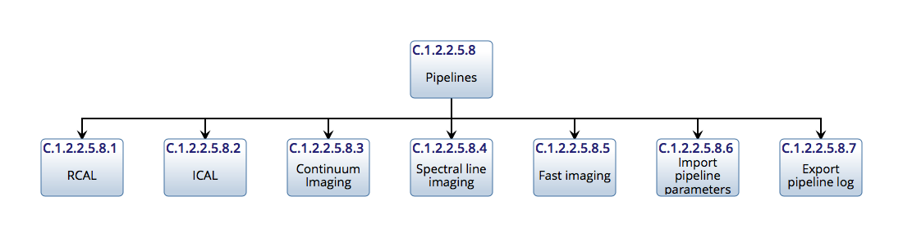
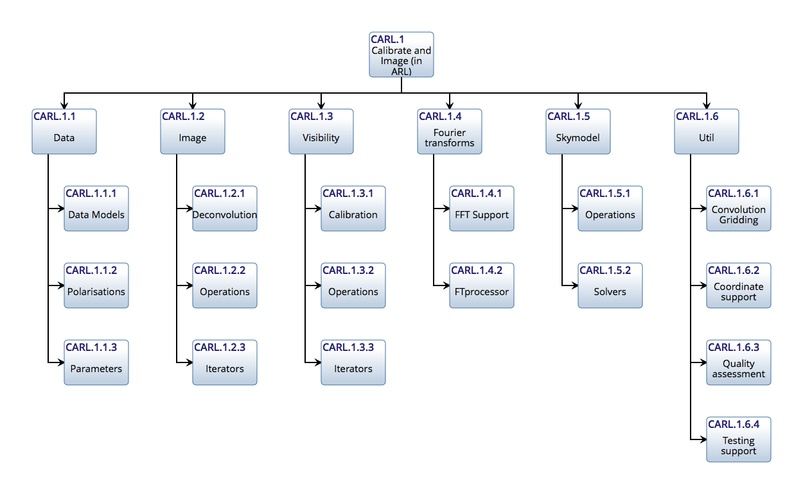

.. Documentation master

.. toctree::
   :maxdepth: 3

Algorithm Reference Library
***************************

The Algorithm Reference Library is used to capture radio interferometry calibration and imaging algorithms in a
reference form for use by SDP contractors. The interfaces all operate with familiar data structures such as image,
visibility table, gaintable, etc.

Background
==========

Core motivations
----------------

- In many software packages, the only function specification is the application code itself. Although the underlying
  algorithm may be published, the implementation tends to diverge over time, making this method of
  documentation less effective. The algorithm reference library is designed to present imaging algorithms in a simple
  Python-based form. This is so that the implemented functions can be seen and understood without resorting to
  interpreting source code shaped by real-world concerns such as optimisations.

- Maintenance of the reference library over time is a choice for operations and we do not discuss it further here.

- Desire for simple test version: for example, scientists may wish to understand how the algorithm works and see it
  tested in particular circumstances. Or a software developer wish to compare it to production code.

Purpose
-------

- Documentation: The primary purpose of the library is to be easily understandable to people not familiar with radio
  interferometry imaging. This means that the library should be broken down into a number of small, well-documented
  functions. Aside from the code itself, these functions will be further explained by documentation as well as material
  demonstrating its usage. Where such efforts would impact the clarity of the code itself it should be kept separate
  (e.g. example notebooks).

- Testbed for experimentation: One purpose for the library is to facilitate experimentation with the algorithm
  without touching the production code. Production code may be specialised due to the need for optimization, however
  the reference implementation should avoid any assumptions not actually  from the theory of interferometry imaging.

- Publication e.g. via github: All algorithms used in production code should be known and published. If the
  algorithms are available separately from the production code then others can make use of the published code for small
  projects or to start on an improved algorithm.

- Conduit for algorithms into SKA: The library can serve as a conduit for algorithms into the SKA production system.
  A scientist can provide Python Version of an algorithm which then can be translated into optimized production code by
  the SKA computer team.

- Algorithm unaffected by optimization: Production code is likely to be obscured by the need to optimize in various
  ways. The algorithms in the library will avoid this as much as possible in order to remain clear and transparent.
  Where algorithms need to be optimised in order to remain executable on typical hardware, we might opt for providing
  multiple equivalent algorithm variants.

- Deliver algorithms for construction phase: The algorithm reference library Will also serve as a resource for the
  delivery of algorithms to the construction phase. It is likely that much of the production code will be written by
  people not intimately familiar with radio astronomy. Experience shows that such developers can often work from a
  simple example of the algorithm.

- Reference for results: The library will also serve to provide reference results for the production code. This is
  not entirely straightforward because the algorithms in both cases work in different contexts. Code that establishes
  interoperability with external code will have to kept separate to not clutter the core implementation.  This means
  that we will not be able to guarantee comparability in all cases. In that case, it will be the responsibility other
  developers of the production code to establish it - for example by using suitably reduced data sets.

Stakeholders
------------

- SDP design team: The principal stakeholders for the algorithm reference library are the SDP Design Team. They will
  benefit from having cleared descriptions of algorithms for all activities such as resource estimation, parameter
  setting, definition of pipelines, and so on.

- SKA Project Scientists: The SKA project scientists must be able to understand the algorithms used in the pipelines.
  This is essential if they are going to be assured that the processing is as desired, and relay that to the observers.

- External scientists: External scientists and observers using the telescope will benefit into ways. First, in
  understanding the processing taking place in the pipelines, and second, being able to bring new algorithms for
  deployment into the pipelines.

- SDP contractors: Depending upon the procurement model, SDP may be developed by a team without very much domain
  knowledge. While expect the documentation of the entire system to be in good shape after CDR, the algorithms are the
  very core of the system I must be communicated clearly and concisely.  We can expect that any possible contractors
  considering a bid would be reassured by the presence of algorithm reference library.

- Outreach: Finally, outreach may be a consumer of the library. For example, the library could be made available
  to students at various levels to introduce them to astronomical data-processing concepts.

Prior art
---------

  LAPACK is an example of a library that mutated into a reference library. The original code was written in
  straightforward FORTRAN  but now many variants have been spawned including for example Versions optimized for
  particular hardware, or using software scheduling techniques such as DAGs to arrange their internal processing.  The
  optimized variants must always agree with the reference code.

Requirements
------------

- Minimal implementation: The implementation should be minimal making use of as few external libraries as possible.
  Python is a good choice for the implementation because the associated libraries are powerful and well-defined.

- Use numpy whenever possible: Some form of numeric processing is inevitably necessary. There is also need for
  efficient bulk data transfer between functions. For consistency, we choose to adopt the numpy library for both
  algorithm and interface definition.

- Take algorithms with established provenance: While the purpose of the library is to define the algorithms clearly,
  the algorithms themselves should have well-defined provenance. Acceptable forms of provenance include publication in a
  peer-reviewed journal, publication in a well-defined memo series, and use in a well-defined production system.  In
  time we might expect that the algorithm reference library will itself provide sufficient provenance. This depends
  upon the processes to maintain the library being stringently defined and applied.

- No optimization: No optimization should be performed on algorithms in the library if doing so obscures the
  fundamentals of the algorithm.  Runtime of the testsuite should not be consideration except in so far as it prevents
  effective use.

- V&V begins here: Validation and verification of the pipeline processing begins in the algorithm reference library.
  That means that it should be held to high standards of submission, testing, curation, and documentation.

- Single threaded: All algorithms should be single threaded unless multithreading is absolutely required to  achieve
  acceptable performance. However, as distributed execution is going to be vital for the SDP, special take should be
  taken to document and demonstrate parallelism opportunities.

- Memory limit: The memory used should be compatible with execution on a personal computer or laptop.

Algorithms to be defined
------------------------

The following list gives an initial set of algorithms to be defined. It is more important to have the overall
framework in place expeditiously than to have each algorithm be state-of-the-art.

   - Simulation

      - Station/Antenna locations
      - Illumination/Primary beam models
      - Generation of visibility data
      - Generation of gain tables

   - Calibration

      - Calibration solvers

         - Stefcal

      - Calibration application

         - Gain interpolation
         - Gain application

      - Self-calibration

   - Visibility plane

      - Convolution kernels

         - Standard
         - W Projection
         - AW Projection
         - AWI Projection

      - Degridding/Gridding

         - 2D
         - W projection
         - W slices
         - W snapshots

      - Preconditioning/Weighting

         - Uniform
         - Briggs

   - Visibility plane to/from Image plane

      - DFT
      - Faceting
      - Phase rotation
      - Averaging/deaveraging
      - Major cycles

   - Image plane

      - Source finding
      - Source fitting
      - Reprojection
      - Interpolation
      - MSClean minor cycle (for spectral line)
      - MSMFS minor cycle (for continuum)

To test and demonstrate completeness, the main pipelines will be implemented:

Testing
-------

- Testing philosophy: The essence of an algorithm reference library is that it should be used as the standard for
  the structure and execution of a particular algorithm.  This can only be done if the algorithm and the associated
  code are tested exhaustively.

- We will use three ways of performing testing of the code

  - Unit tests of all functions:
  - Regression tests of the complete algorithm over a complete set of inputs.
  - Code reviews (either single person or group read-throughs).

- Test suite via Jenkins: The algorithm reference library will therefore come with a complete set of unit tests and
  regression tests. These should be run automatically, by, for example, a framework such as Jenkins, on any change to
  ensure their errors are caught quickly and not compounded.

Fourier processing
******************

There are many algorithms for imaging, using different approaches to correct for various effects:

+ Simple 2D transforms
+ Partitioned image (i.e. faceted) and uv transforms
+ W projection
+ W snapshots
+ W slices
+ A projection variants
+ Visibility coalescence and de-coalescence
+ MFS variants
+ Differential residuals calculations

Since the scale of SDP is so much larger than previous telescopes, it is not clear which scaling strategies and
algorithms are going to offer the best performance. For this reason, it is important the synthesis framework not be
restrictive.

All the above functions are linear in the visibilities and image. The 2D transform is correct for sufficiently
restricted context. Hence we will layer all algorithms on top of the 2D transform. This means that a suitable
framework decomposes the overall transform into suitable linear combinations of invocations of 2D transforms. We can
use python iterators to perform the subsectioning. For example, the principal image iteration via a raster
implemented by a python generator::

        m31model=create_test_image()
        for ipatch in raster(m31model, nraster=2):
            # each image patch can be used to add to the visibility data
            vis + = predict_2d(vis, ipatch, params)

        # For image partitioning and snapshot processing
        iraster, interval = find_optimum_iraster_times(vis, model)
        m31model=create_test_image()
        for ipatch in raster(m31model, nraster=iraster):
            for subvis in snapshot(vis, interval=interval):
                # each patch can be used to add to the visibility data
                subvis + = predict_2d(subvis, ipatch, params)

This relies upon the data objects (model and vis) possessing sufficient meta data to enable operations such as phase
rotation from one frame to another.

In addition, iteration through the visibility data must tbe varied:

+ By time
+ By frequency
+ By w
+ By parallactic angle

The Visibility API should support these forms of iteration.

The pattern used in these algorithms is abstracted in the following diagram:

.. image:: ./ARL_fourier_processing.png
      :width: 1024px

These can be defined as stateless functions::

    def predict_image_partition(vis, model, predict_function, params):
        """ Predict using image partitions

        """
        nraster = get_parameter(params, "image_partitions", 3)
        for ipatch in raster(model, nraster=nraster):
            predict_function(vis, ipatch, params)

        return vis

    def predict_wslices(vis, model, predict_function, params):
        """ Predict using image partitions

        """
        wstep = get_parameter(params, "wstep", 1000)
        for ipatch in wslice(model, wstep):
            predict_function(vis, ipatch, params)

        return vis

These can be nested as such::

    predict_wslices(vis, model, predict_function=predict_image_partition)

This will perform wslice transforms and inside those, image partition transforms.

Best Practices
**************

Coding and documentation
========================

Use the `SIP Coding and Documentation Guide <https://confluence.ska-sdp
.org/display/SIP/Coding+and+Documentation+Guide+for+SIP/>`_ .

We recommend using a tool to help ensure PEP 8 compliance. PyCharm does a good job at this and other code quality
checks.

Design
======

The ARL has been designed in line with the following principles:

+ Data are held in Classes.
+ The Data Classes correspond to familiar concepts in radio astronomy packages e.g. visibility, gaintable, image.
+ The data members of the Data Classes are directly accessible by name e.g. .data, .name. .phasecentre.
+ Direct access to the data members is envisaged.
+ There are no methods attached to the data classes apart from variant constructors as needed.
+ Standalone, stateless functions are used for all processing.
+ All function parameters are passed by the kwargs mechanism.

Additions and changes should adhere to these principles.

Naming
======

* Names should obey the `SIP Coding and Documentation Guide <https://confluence.ska-sdp.org/display/SIP/Coding+and+Documentation+Guide+for+SIP/>`_ guide.
* For functions that move data in and out of ARL, use import/export.
* For functions that provide persistent, use read/save.

ARL definition
**************

Functional Model
================

The functional model corresponds to the pipelines:

.. image:: ./ARL_functional.png
   :scale: 50 %

Data Models
===========

The data models are:

.. image:: ./ARL_data.png
   :scale: 75 %

.. automodule:: arl.data.data_models
   :members:

Processing Parameters
=====================

All components possess an API which is always of the form::

      def processing_function(idatastruct1, idatastruct2, ..., processingparameters):
         return odatastruct1, odatastruct2,... other

Processing parameters are passed via a dictionary. Universal parameters can be set at the top level of the
dictionary. The parameters specific to a given function can stored in a field named by the function. For example::

   parameters = {'log': 'tims.log',
      'RCAL': {'visibility': self.visibility, 'skymodel': self.m31sm}
      'solve_gain': {'Gsolint': 300.0}}

   qa = RCAL(parameters}

Inside a function, the values are retrieved thus::

    log = get_parameter(params, 'log', None)
    vis = get_parameter(params, 'visibility', None)
    sm = get_parameter(params, 'skymodel', None)

The search for a keyword is first in the keys of parameters and then in parameters[functioname].

Function parameters should obey a consistent naming convention:

=======  =======
Name     Meaning
=======  =======
vis      Name of Visibility
sm       Name of SkyModel
sc       Name of Skycomponent
gt       Name of GainTable
conf     Name of Configuration
im       Name of input image
qa       Name of quality assessment
params   Name of processing parameters
log      Name of processing log
=======  =======

If a function argument has a better, more descriptive name e.g. normalised_gt, newphasecentre, use it.

Keyword=value pairs should have descriptive names. The names should be lower case with underscores to separate words:

====================    ==================================  ========================================================
Name                    Meaning                             Example
====================    ==================================  ========================================================
loop_gain               Clean loop gain                     0.1
niter                   Number of iterations                10000
eps                     Fractional tolerance                1e-6
threshold               Absolute threshold                  0.001
fractional_threshold    Threshold as fraction of e.g. peak  0.1
G_solution_interval     Solution interval for G term        100
phaseonly               Do phase-only solutions             True
phasecentre             Phase centre (usually as SkyCoord)  SkyCoord("-1.0d", "37.0d", frame='icrs', equinox=2000.0)
spectral_mode           Visibility processing mode          'mfs' or 'channel'
====================    ==================================  ========================================================

ARL API
=======

The data structures are operated on by state-less components arranged into the following modules:

The complete set of components is:

.. image:: ./ARL_all.png
   :width: 1024px

Data
----

Parameter handling
++++++++++++++++++

.. automodule:: arl.data.parameters
   :members:

Polarisation
++++++++++++

.. automodule:: arl.data.polarisation
   :members:

Image
-----

Deconvolution
+++++++++++++

.. automodule:: arl.image.deconvolution
   :members:

Operations
++++++++++

.. automodule:: arl.image.operations
   :members:

Iterators
+++++++++

.. automodule:: arl.image.iterators
   :members:

Fourier transform
-----------------

FFT support
+++++++++++

.. automodule:: arl.fourier_transforms.fft_support
   :members:

FTProcessor
+++++++++++

.. automodule:: arl.fourier_transforms.ftprocessor
   :members:

Convolutional Gridding
++++++++++++++++++++++

.. automodule:: arl.fourier_transforms.convolutional_gridding
   :members:

SkyModel
--------

Operations
++++++++++

.. automodule:: arl.skymodel.operations
   :members:

Solvers
+++++++

.. automodule:: arl.skymodel.solvers
   :members:

Visibility
----------

Calibration
+++++++++++

.. automodule:: arl.visibility.calibration
   :members:

Iterators
+++++++++

.. automodule:: arl.visibility.iterators
   :members:

Operations
++++++++++

.. automodule:: arl.visibility.operations
   :members:

Coordinate Support
------------------

Internal Routines
-----------------

.. automodule:: arl.core.c
   :members:

Definition of coordinate systems
++++++++++++++++++++++++++++++++

From http://casa.nrao.edu/Memos/CoordConvention.pdf :

UVW is a right-handed coordinate system, with W pointing towards the
source, and a baseline convention of :math:`ant2 - ant1` where
:math:`index(ant1) < index(ant2)`.  Consider an XYZ Celestial
coordinate system centered at the location of the interferometer, with
:math:`X` towards the East, :math:`Z` towards the NCP and :math:`Y` to
complete a right-handed system. The UVW coordinate system is then
defined by the hour-angle and declination of the phase-reference
direction such that

1. when the direction of observation is the NCP (`ha=0,dec=90`),
   the UVW coordinates are aligned with XYZ,

2. V, W and the NCP are always on a Great circle,

3. when W is on the local meridian, U points East

4. when the direction of observation is at zero declination, an
   hour-angle of -6 hours makes W point due East.

The :math:`(l,m,n)` coordinates are parallel to :math:`(u,v,w)` such
that :math:`l` increases with Right-Ascension (or increasing longitude
coordinate), :math:`m` increases with Declination, and :math:`n` is
towards the source. With this convention, images will have Right
Ascension increasing from Right to Left, and Declination increasing
from Bottom to Top.

Util
----

Coordinate Support
++++++++++++++++++

.. automodule:: arl.util.coordinate_support
   :members:

Testing Support
+++++++++++++++

.. automodule:: arl.util.testing_support
   :members:

Quality Assessment
++++++++++++++++++

.. automodule:: arl.util.quality_assessment
   :members:

Pipelines
---------

Functions
+++++++++

.. automodule:: arl.pipelines.functions
   :members:

Support
+++++++

.. automodule:: arl.pipelines.support
   :members:

Unit tests
**********

Unit tests written in standard python style are available.

.. automodule:: tests.test_convolutional_gridding
   :members:
   :undoc-members:

.. automodule:: tests.test_coordinate_support
   :members:
   :undoc-members:

.. automodule:: tests.test_datamodels
   :members:
   :undoc-members:

.. automodule:: tests.test_fft_support
   :members:
   :undoc-members:

.. automodule:: tests.test_ftprocessor
   :members:
   :undoc-members:

.. automodule:: tests.test_image_deconvolution
   :members:
   :undoc-members:

.. automodule:: tests.test_image_iterators
   :members:
   :undoc-members:

.. automodule:: tests.test_image_operations
   :members:
   :undoc-members:

.. automodule:: tests.test_parameters
   :members:
   :undoc-members:

.. automodule:: tests.test_pipelines
   :members:
   :undoc-members:

.. automodule:: tests.test_quality_assessment
   :members:
   :undoc-members:

.. automodule:: tests.test_visibility_calibration
   :members:
   :undoc-members:

.. automodule:: tests.test_visibility_operations
   :members:
   :undoc-members:

ARL Notebooks
*************

.. toctree::
   :maxdepth: 2

   arl/imaging
   arl/imaging-wterm

References
**********

* 1974A&AS...15..417H : *Aperture Synthesis with a Non-Regular
  Distribution of Interferometer Baselines*, Högbom, J. A.,
  http://cdsads.u-strasbg.fr/abs/1974A%26AS...15..417H

* RauThesis2010: *PARAMETERIZED DECONVOLUTION FOR WIDE-BAND RADIO
  SYNTHESIS IMAGING*, Urvashi Rao Venkata, New Mexico Institute of
  Mining and Technology, May, 2010

* SAULT1996: Sault, R. J., L. Staveley-Smith, and W. N. Brouw. "An
    approach to interferometric mosaicing." Astronomy and Astrophysics
    Supplement Series 120 (1996): 375-384.

Glossary
********

.. glossary::

   clean
      A popular algorithm for deconvolving

   deconvolve
      Remove the effects of a point spread function from a dirty image

* :ref:`genindex`
* :ref:`modindex`
* :ref:`search`

