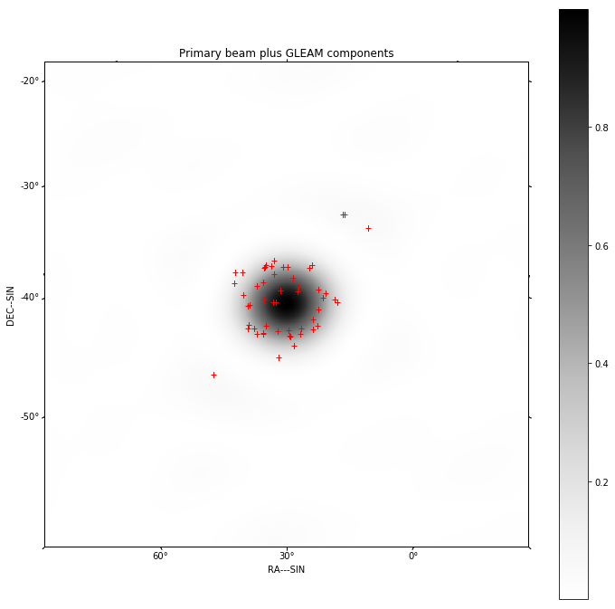
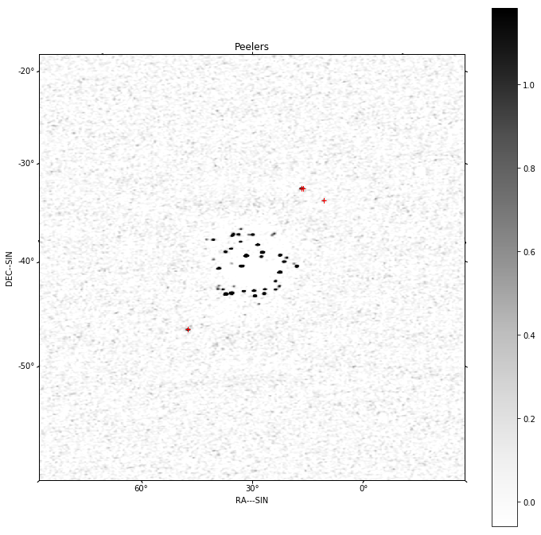
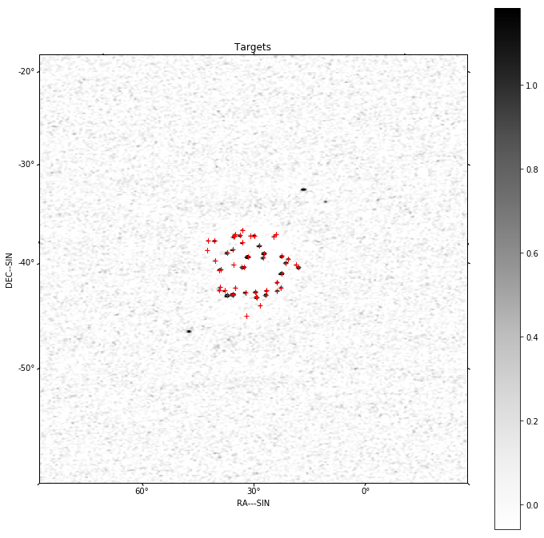
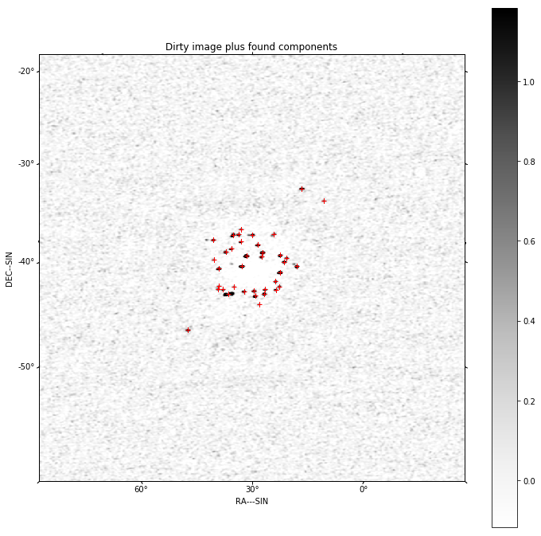
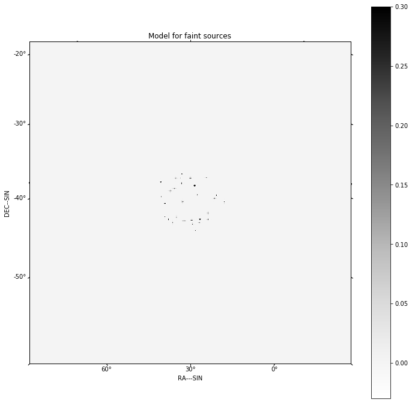
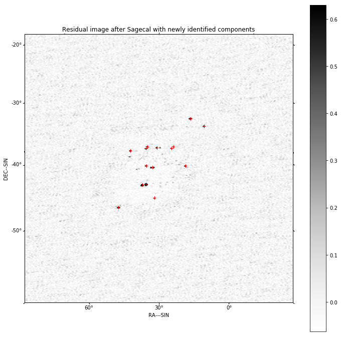
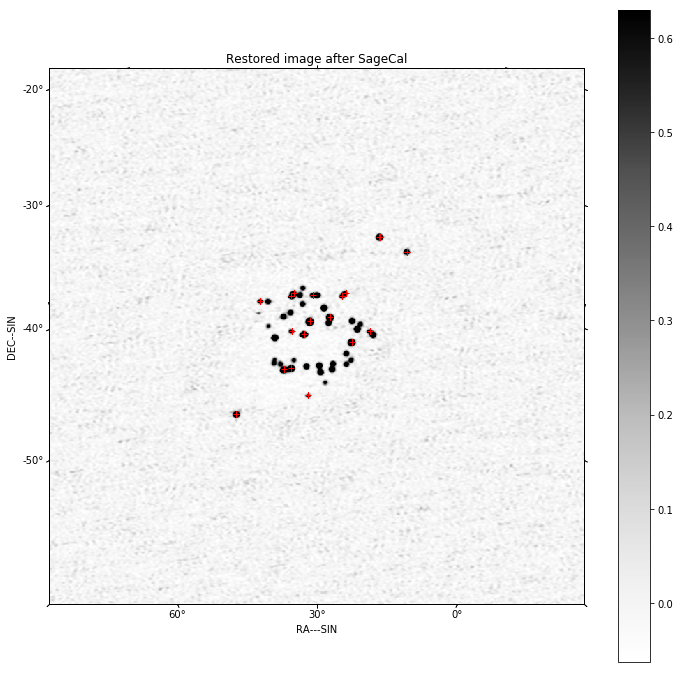
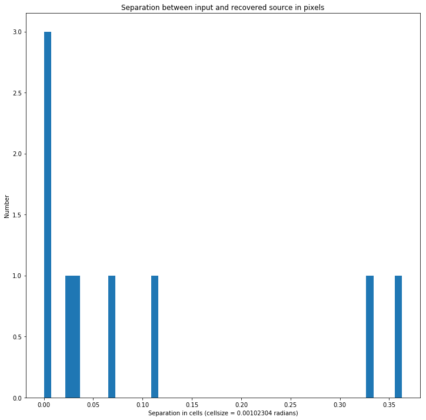
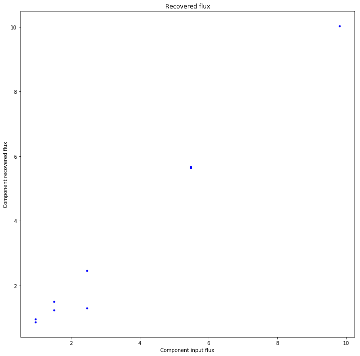
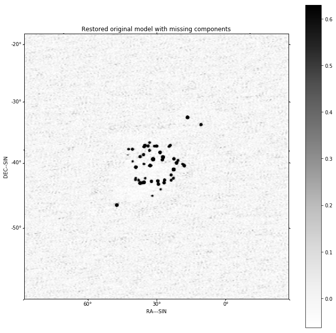

Calibration of non-isoplanatic low frequency data
=================================================

This uses an implementation of the SageCAL algorithm to calibrate a
simulated SKA1LOW observation in which sources inside the primary beam
have one set of calibration errors and sources outside have different
errors.

In this example, the peeler sources are held fixed in strength and
location and only the gains solved. The other sources, inside the
primary beam, are partitioned into weak (<5Jy) and strong (>5Jy). The
weak sources are processed collectively as an image. The bright sources
are processed individually.

.. code:: ipython3

    % matplotlib inline
    
    import os
    import sys
    
    sys.path.append(os.path.join('..', '..'))
    
    from data_models.parameters import arl_path
    
    results_dir = arl_path('test_results')
    
    import numpy
    
    from astropy.coordinates import SkyCoord
    from astropy import units as u
    from astropy.wcs.utils import pixel_to_skycoord
    
    from matplotlib import pyplot as plt
    
    from data_models.memory_data_models import SkyModel
    from data_models.polarisation import PolarisationFrame
    
    from processing_components.component_support.arlexecute import arlexecute
    
    from processing_components.skycomponent.operations import find_skycomponents
    from processing_components.calibration.calibration import solve_gaintable
    from processing_components.calibration.operations import apply_gaintable, create_gaintable_from_blockvisibility
    from processing_components.visibility.base import create_blockvisibility, copy_visibility
    from processing_components.image.deconvolution import restore_cube
    from processing_components.skycomponent.operations import select_components_by_separation, insert_skycomponent, \
        select_components_by_flux
    from processing_components.image.operations import show_image, qa_image, copy_image, create_empty_image_like
    from processing_components.util.testing_support import create_named_configuration, create_low_test_beam, \
        simulate_gaintable, create_low_test_skycomponents_from_gleam
    from processing_components.skycomponent.operations import apply_beam_to_skycomponent, find_skycomponent_matches
    from processing_components.imaging.base import create_image_from_visibility, advise_wide_field, \
        predict_skycomponent_visibility
    from processing_components.imaging.imaging_functions import invert_function
    
    from processing_components.calibration.calskymodel_components import calskymodel_solve_component
    
    from processing_components.component_support.dask_init import get_dask_Client
    from processing_components.image.operations import export_image_to_fits
    
    import logging
    
    def init_logging():
        log = logging.getLogger()
        logging.basicConfig(filename='%s/skymodel_cal.log' % results_dir,
                            filemode='a',
                            format='%(thread)s %(asctime)s,%(msecs)d %(name)s %(levelname)s %(message)s',
                            datefmt='%H:%M:%S',
                            level=logging.INFO)
    log = logging.getLogger()
    logging.info("Starting skymodel_cal")

Use Dask throughout

.. code:: ipython3

    arlexecute.set_client(get_dask_Client())
    arlexecute.run(init_logging)

.. parsed-literal::

    Creating LocalCluster and Dask Client
    <Client: scheduler='tcp://127.0.0.1:50552' processes=8 cores=8>
    Diagnostic pages available on port http://127.0.0.1:8787

.. parsed-literal::

    {'tcp://127.0.0.1:50561': None,
     'tcp://127.0.0.1:50564': None,
     'tcp://127.0.0.1:50565': None,
     'tcp://127.0.0.1:50567': None,
     'tcp://127.0.0.1:50571': None,
     'tcp://127.0.0.1:50573': None,
     'tcp://127.0.0.1:50575': None,
     'tcp://127.0.0.1:50589': None}

We make the visibility. The parameter rmax determines the distance of
the furthest antenna/stations used. All over parameters are determined
from this number.

We set the w coordinate to be zero for all visibilities so as not to
have to do full w-term processing. This speeds up the imaging steps.

.. code:: ipython3

    nfreqwin = 1
    ntimes = 1
    rmax = 750
    frequency = numpy.linspace(0.8e8, 1.2e8, nfreqwin)
    if nfreqwin > 1:
        channel_bandwidth = numpy.array(nfreqwin * [frequency[1] - frequency[0]])
    else:
        channel_bandwidth = [0.4e8]
    times = numpy.linspace(-numpy.pi / 3.0, numpy.pi / 3.0, ntimes)
    
    phasecentre=SkyCoord(ra=+30.0 * u.deg, dec=-45.0 * u.deg, frame='icrs', equinox='J2000')
    lowcore = create_named_configuration('LOWBD2', rmax=rmax)
    
    block_vis = create_blockvisibility(lowcore, times, frequency=frequency,
        channel_bandwidth=channel_bandwidth, weight=1.0, phasecentre=phasecentre,
        polarisation_frame=PolarisationFrame("stokesI"), zerow=True)

.. code:: ipython3

    wprojection_planes=1
    advice=advise_wide_field(block_vis, guard_band_image=5.0, delA=0.02, 
                             wprojection_planes=wprojection_planes)
    
    vis_slices = advice['vis_slices']
    npixel=advice['npixels2']
    cellsize=advice['cellsize']

Generate the model from the GLEAM catalog, including application of the
primary beam.

.. code:: ipython3

    beam = create_image_from_visibility(block_vis, npixel=npixel, frequency=frequency,
        nchan=nfreqwin, cellsize=cellsize, phasecentre=phasecentre)
    
    original_gleam_components = create_low_test_skycomponents_from_gleam(flux_limit=1.0,
        phasecentre=phasecentre, frequency=frequency, 
        polarisation_frame=PolarisationFrame('stokesI'),
        radius=npixel * cellsize/2.0)
    
    beam = create_low_test_beam(beam)
    pb_gleam_components = apply_beam_to_skycomponent(original_gleam_components, beam, 
                                                           flux_limit=0.5)
    from matplotlib import pylab
    pylab.rcParams['figure.figsize'] = (12.0, 12.0)
    pylab.rcParams['image.cmap'] = 'rainbow'
    
    
    show_image(beam, components=pb_gleam_components, cm='Greys', title='Primary beam plus GLEAM components')
    print("Number of components %d" % len(pb_gleam_components))

.. parsed-literal::

    Number of components 53

Generate the template image

.. code:: ipython3

    model = create_image_from_visibility(block_vis, npixel=npixel, 
                                         frequency=[numpy.average(frequency)], 
                                         nchan=1,
                                         channel_bandwidth=[numpy.sum(channel_bandwidth)], 
                                         cellsize=cellsize, phasecentre=phasecentre)

Create sources to be peeled

.. code:: ipython3

    peel_distance = 0.16
    peelers = select_components_by_separation(phasecentre, pb_gleam_components, 
                                              min=peel_distance)
    gleam_components = select_components_by_separation(phasecentre, pb_gleam_components, 
                                              max=peel_distance)
    print("There are %d sources inside the primary beam and %d sources outside"
         % (len(gleam_components), len(peelers)))

.. parsed-literal::

    There are 49 sources inside the primary beam and 4 sources outside

Create the model visibilities, applying a different gain table for
peeled sources and other components

.. code:: ipython3

    corrupted_vis = copy_visibility(block_vis, zero=True)
    gt = create_gaintable_from_blockvisibility(block_vis, timeslice='auto')
    
    components_errors = [(p, 1.0) for p in peelers]
    components_errors.append((pb_gleam_components, 0.1))
    
    for sc, phase_error in components_errors:
        component_vis = copy_visibility(block_vis, zero=True)
        gt = simulate_gaintable(gt, amplitude_error=0.0, phase_error=phase_error)
        component_vis = predict_skycomponent_visibility(component_vis, sc)
        component_vis = apply_gaintable(component_vis, gt)
        corrupted_vis.data['vis'][...]+=component_vis.data['vis'][...]
        
    dirty, sumwt = invert_function(corrupted_vis, model, context='2d')
    qa=qa_image(dirty)
    vmax=qa.data['medianabs']*20.0
    vmin=-qa.data['medianabs']
    print(qa)
    export_image_to_fits(dirty, '%s/calskymodel_before_dirty.fits' % results_dir)
    show_image(dirty, cm='Greys', components=peelers, vmax=vmax, vmin=vmin, title='Peelers')
    show_image(dirty, cm='Greys', components=gleam_components, vmax=vmax, vmin=vmin, title='Targets')
    plt.show()

.. parsed-literal::

    Quality assessment:
    	Origin: qa_image
    	Context: 
    	Data:
    		shape: '(1, 1, 768, 768)'
    		max: '9.812568624588987'
    		min: '-0.32806354652374486'
    		rms: '0.1248323283671823'
    		sum: '-91.09803695076823'
    		medianabs: '0.059189248683692776'
    		median: '-0.010041136895063809'
    

Find the components above the threshold

.. code:: ipython3

    qa = qa_image(dirty)
    vmax=qa.data['medianabs']*20.0
    vmin=-qa.data['medianabs']*2.0
    print(qa)
    threshold = 10.0*qa.data['medianabs']
    print("Selecting sources brighter than %f" % threshold)
    initial_found_components= find_skycomponents(dirty, threshold=threshold)
    show_image(dirty, components=initial_found_components, cm='Greys', vmax=vmax, vmin=vmin,
               title='Dirty image plus found components')
    plt.show()

.. parsed-literal::

    Quality assessment:
    	Origin: qa_image
    	Context: 
    	Data:
    		shape: '(1, 1, 768, 768)'
    		max: '9.812568624588987'
    		min: '-0.32806354652374486'
    		rms: '0.1248323283671823'
    		sum: '-91.09803695076823'
    		medianabs: '0.059189248683692776'
    		median: '-0.010041136895063809'
    
    Selecting sources brighter than 0.591892

.. code:: ipython3

    peel_distance = 0.16
    flux_threshold=5.0
    peelers = select_components_by_separation(phasecentre, initial_found_components, 
                                              min=peel_distance)
    
    inbeam_components = select_components_by_separation(phasecentre, initial_found_components, 
                                              max=peel_distance)
    
    bright_components = select_components_by_flux(inbeam_components, fmin=flux_threshold)
    faint_components = select_components_by_flux(inbeam_components, fmax=flux_threshold)
    
    print("%d sources will be peeled (i.e. held fixed but gain solved)" % len(peelers))
    print("%d bright sources will be processed as components (solved both as component and for gain)" % len(bright_components))
    print("%d faint sources will be processed collectively as a fixed image and gain solved" % len(faint_components))
    
    faint_model = create_empty_image_like(model)
    faint_model = insert_skycomponent(faint_model, faint_components, insert_method='Lanczos')
    
    show_image(faint_model,  cm='Greys', title='Model for faint sources', vmax=0.3, vmin=-0.03)
    plt.show()
                      
    calskymodel_graph = [arlexecute.execute(SkyModel, nout=1)(components=[p], fixed=True) for p in peelers] \
        + [arlexecute.execute(SkyModel, nout=1)(components=[b], fixed=False) for b in bright_components] \
        + [arlexecute.execute(SkyModel, nout=1)(images=[faint_model], fixed=True)]

.. parsed-literal::

    3 sources will be peeled (i.e. held fixed but gain solved)
    3 bright sources will be processed as components (solved both as component and for gain)
    32 faint sources will be processed collectively as a fixed image and gain solved

Run skymodel\_cal using dask

.. code:: ipython3

    corrupted_vis = arlexecute.scatter(corrupted_vis)
    graph = calskymodel_solve_component(corrupted_vis, calskymodel_graph, niter=30, gain=0.25, tol=1e-8)
    calskymodel, residual_vis = arlexecute.compute(graph, sync=True)

.. parsed-literal::

    WARNING: FITSFixedWarning: The WCS transformation has more axes (4) than the image it is associated with (0) [astropy.wcs.wcs]
    WARNING:astropy:FITSFixedWarning: The WCS transformation has more axes (4) than the image it is associated with (0)

.. parsed-literal::

    arlexecute.compute: Synchronous execution took 191.123 seconds

Combine all components for display

.. code:: ipython3

    skymodel_components = list()
    for csm in calskymodel:
        skymodel_components += csm[0].components

Check that the peeled sources are not altered

.. code:: ipython3

    recovered_peelers = find_skycomponent_matches(peelers, skymodel_components, 1e-5)
    ok = True
    for p in recovered_peelers:
        ok = ok and numpy.abs(peelers[p[0]].flux[0,0] - skymodel_components[p[1]].flux[0,0]) < 1e-7
    print("Peeler sources flux unchanged: %s" % ok)
    ok = True
    for p in recovered_peelers:
        ok = ok and peelers[p[0]].direction.separation(skymodel_components[p[1]].direction).rad < 1e-15
    print("Peeler sources directions unchanged: %s" % ok)

.. parsed-literal::

    Peeler sources flux unchanged: True
    Peeler sources directions unchanged: True

Now we find the components in the residual image and add those to the
existing model

.. code:: ipython3

    residual, sumwt = invert_function(residual_vis, model, context='2d')
    qa = qa_image(residual)
    vmax=qa.data['medianabs']*30.0
    vmin=-qa.data['medianabs']*3.0
    print(qa)
    threshold = 20.0*qa.data['medianabs']
    print("Selecting sources brighter than %f" % threshold)
    
    final_found_components = find_skycomponents(residual, threshold=threshold)
    show_image(residual, components=final_found_components, cm='Greys', 
               title='Residual image after Sagecal with newly identified components', vmax=vmax, vmin=vmin)
    
    plt.show()
    
    final_components= skymodel_components + final_found_components

.. parsed-literal::

    Quality assessment:
    	Origin: qa_image
    	Context: 
    	Data:
    		shape: '(1, 1, 768, 768)'
    		max: '4.165903533017875'
    		min: '-0.267212788239266'
    		rms: '0.043505157661692447'
    		sum: '-22.49525731941501'
    		medianabs: '0.020989756638119663'
    		median: '-0.004748312180845311'
    
    Selecting sources brighter than 0.419795

Make a restored image

.. code:: ipython3

    psf, _ = invert_function(residual_vis, model, dopsf=True, context='2d')
    
    component_image = copy_image(faint_model)
    component_image = insert_skycomponent(component_image, final_components)
    restored = restore_cube(component_image, psf, residual)
    export_image_to_fits(restored, '%s/calskymodel_restored.fits' % results_dir)
    
    qa=qa_image(restored, context='Restored image after SageCal')
    print(qa)
    
    show_image(restored, components=final_components, cm='Greys', 
               title='Restored image after SageCal', vmax=vmax, vmin=vmin)
    plt.show()

.. parsed-literal::

    Quality assessment:
    	Origin: qa_image
    	Context: Restored image after SageCal
    	Data:
    		shape: '(1, 1, 768, 768)'
    		max: '10.126215833390003'
    		min: '-0.10702470513474371'
    		rms: '0.12926266408290338'
    		sum: '3846.4348198823327'
    		medianabs: '0.02110984426460849'
    		median: '-0.00440246511335542'
    

Now match the recovered components to the originals

.. code:: ipython3

    original_bright_components = peelers + bright_components
    matches = find_skycomponent_matches(final_components, original_bright_components, 3*cellsize)

Look at the range of separations found

.. code:: ipython3

    separations = [match[2] for match in matches]
    plt.clf()
    plt.hist(separations/cellsize, bins=50)
    plt.title('Separation between input and recovered source in pixels')
    plt.xlabel('Separation in cells (cellsize = %g radians)' % cellsize)
    plt.ylabel('Number')
    plt.show()

Now look at the matches between the original components and those
recovered.

.. code:: ipython3

    totalfluxin = numpy.sum([c.flux[0,0] for c in pb_gleam_components]) 
    totalfluxout = numpy.sum([c.flux[0,0] for c in final_components]) + numpy.sum(faint_model.data)
    print("Recovered %.3f (Jy) of original %.3f (Jy)" % (totalfluxout, totalfluxin))
    found = [match[1] for match in matches]
    notfound = list()
    for c in range(len(original_bright_components)):
        if c not in found:
            notfound.append(c)
            
    print("The following original components were not found", notfound)

.. parsed-literal::

    Recovered 104.988 (Jy) of original 109.996 (Jy)
    The following original components were not found []

Look at the recovered flux and the location of the unmatched components.
From the image display these seem to be blends of close components.

.. code:: ipython3

    fluxin = [original_bright_components[match[1]].flux[0,0] for match in matches]
    fluxout = [final_components[match[0]].flux[0,0] for match in matches]
    missed_components = [original_bright_components[c] for c in notfound]
    missed_flux = [match.flux[0,0] for match in missed_components]
        
    plt.clf()
    plt.plot(fluxin, fluxout, '.', color='blue')
    plt.plot(missed_flux, len(missed_flux)*[0.0], '.', color='red')
    
    plt.title('Recovered flux')
    plt.xlabel('Component input flux')
    plt.ylabel('Component recovered flux')
    plt.show()
    
    show_image(restored, components=missed_components, cm='Greys', 
               title='Restored original model with missing components', vmax=vmax, vmin=vmin)
    plt.show()

.. code:: ipython3

    arlexecute.close()
