Pipeline processing using Dask
==============================

This notebook demonstrates the continuum imaging and ICAL pipelines.

.. code:: ipython3

    % matplotlib inline
    
    import os
    import sys
    
    sys.path.append(os.path.join('..', '..'))
    
    from data_models.parameters import arl_path
    
    results_dir = arl_path('test_results')
    
    from matplotlib import pylab
    
    pylab.rcParams['figure.figsize'] = (12.0, 12.0)
    pylab.rcParams['image.cmap'] = 'rainbow'
    
    import numpy
    
    from astropy.coordinates import SkyCoord
    from astropy import units as u
    from astropy.wcs.utils import pixel_to_skycoord
    
    from matplotlib import pyplot as plt
    
    from data_models.polarisation import PolarisationFrame
    
    from processing_components.calibration.calibration import solve_gaintable
    from processing_components.calibration.operations import apply_gaintable
    from processing_components.calibration.calibration_control import create_calibration_controls
    from processing_components.visibility.base import create_blockvisibility
    from processing_components.skycomponent.operations import create_skycomponent
    from processing_components.image.deconvolution import deconvolve_cube
    from processing_components.image.operations import show_image, export_image_to_fits, qa_image
    from processing_components.visibility.iterators import vis_timeslice_iter
    from processing_components.util.testing_support import create_named_configuration, create_low_test_image_from_gleam
    from processing_components.imaging.base import predict_2d, create_image_from_visibility, advise_wide_field
    
    from processing_components.component_support.dask_init import get_dask_Client
    from processing_components.imaging.imaging_components import invert_component, predict_component, \
        deconvolve_component
    from processing_components.util.support_components import simulate_component, \
        corrupt_component
    from processing_components.pipelines.pipeline_components import continuum_imaging_component, \
        ical_component
    
    from processing_components.component_support.arlexecute import arlexecute
    
    import pprint
    
    pp = pprint.PrettyPrinter()
    
    import logging
    
    def init_logging():
        log = logging.getLogger()
        logging.basicConfig(filename='%s/imaging-pipeline.log' % results_dir,
                            filemode='a',
                            format='%(asctime)s,%(msecs)d %(name)s %(levelname)s %(message)s',
                            datefmt='%H:%M:%S',
                            level=logging.INFO)
    log = logging.getLogger()
    logging.info("Starting imaging-pipeline")

We will use dask

.. code:: ipython3

    arlexecute.set_client(get_dask_Client())
    arlexecute.run(init_logging)

.. parsed-literal::

    Creating LocalCluster and Dask Client
    <Client: scheduler='tcp://127.0.0.1:61743' processes=8 cores=8>
    Diagnostic pages available on port http://127.0.0.1:61744

.. parsed-literal::

    {'tcp://127.0.0.1:61753': None,
     'tcp://127.0.0.1:61755': None,
     'tcp://127.0.0.1:61757': None,
     'tcp://127.0.0.1:61759': None,
     'tcp://127.0.0.1:61761': None,
     'tcp://127.0.0.1:61762': None,
     'tcp://127.0.0.1:61770': None,
     'tcp://127.0.0.1:61773': None}

.. code:: ipython3

    pylab.rcParams['figure.figsize'] = (12.0, 12.0)
    pylab.rcParams['image.cmap'] = 'Greys'

We create a graph to make the visibility. The parameter rmax determines
the distance of the furthest antenna/stations used. All over parameters
are determined from this number.

.. code:: ipython3

    nfreqwin=7
    ntimes=11
    rmax=300.0
    frequency=numpy.linspace(0.9e8,1.1e8,nfreqwin)
    channel_bandwidth=numpy.array(nfreqwin*[frequency[1]-frequency[0]])
    times = numpy.linspace(-numpy.pi/3.0, numpy.pi/3.0, ntimes)
    phasecentre=SkyCoord(ra=+30.0 * u.deg, dec=-60.0 * u.deg, frame='icrs', equinox='J2000')
    
    vis_list=simulate_component('LOWBD2',
                                             frequency=frequency, 
                                             channel_bandwidth=channel_bandwidth,
                                             times=times,
                                             phasecentre=phasecentre,
                                             order='frequency',
                                            rmax=rmax)
    print('%d elements in vis_list' % len(vis_list))
    log.info('About to make visibility')
    vis_list = arlexecute.compute(vis_list, sync=True)

.. parsed-literal::

    7 elements in vis_list
    arlexecute.compute: Execution using Dask took 6.509 seconds

.. code:: ipython3

    wprojection_planes=1
    advice_low=advise_wide_field(vis_list[0], guard_band_image=8.0, delA=0.02,
                                 wprojection_planes=wprojection_planes)
    
    advice_high=advise_wide_field(vis_list[-1], guard_band_image=8.0, delA=0.02,
                                  wprojection_planes=wprojection_planes)
    
    vis_slices = advice_low['vis_slices']
    npixel=advice_high['npixels2']
    cellsize=min(advice_low['cellsize'], advice_high['cellsize'])

Now make a graph to fill with a model drawn from GLEAM

.. code:: ipython3

    gleam_model = [arlexecute.execute(create_low_test_image_from_gleam)(npixel=npixel,
                                                                   frequency=[frequency[f]],
                                                                   channel_bandwidth=[channel_bandwidth[f]],
                                                                   cellsize=cellsize,
                                                                   phasecentre=phasecentre,
                                                                   polarisation_frame=PolarisationFrame("stokesI"),
                                                                   flux_limit=1.0,
                                                                   applybeam=True)
                         for f, freq in enumerate(frequency)]
    log.info('About to make GLEAM model')
    gleam_model = arlexecute.compute(gleam_model, sync=True)
    future_gleam_model = arlexecute.scatter(gleam_model)

.. parsed-literal::

    WARNING: FITSFixedWarning: The WCS transformation has more axes (4) than the image it is associated with (0) [astropy.wcs.wcs]
    WARNING:astropy:FITSFixedWarning: The WCS transformation has more axes (4) than the image it is associated with (0)

.. parsed-literal::

    arlexecute.compute: Execution using Dask took 128.701 seconds

.. code:: ipython3

    log.info('About to run predict to get predicted visibility')
    future_vis_graph = arlexecute.scatter(vis_list)
    predicted_vislist = predict_component(future_vis_graph, gleam_model,  
                                                    context='wstack', vis_slices=vis_slices)
    predicted_vislist = arlexecute.compute(predicted_vislist, sync=True)
    corrupted_vislist = corrupt_component(predicted_vislist, phase_error=1.0)
    log.info('About to run corrupt to get corrupted visibility')
    corrupted_vislist =  arlexecute.compute(corrupted_vislist, sync=True)
    future_predicted_vislist=arlexecute.scatter(predicted_vislist)

.. parsed-literal::

    arlexecute.compute: Execution using Dask took 53.607 seconds
    arlexecute.compute: Execution using Dask took 2.047 seconds

Get the LSM. This is currently blank.

.. code:: ipython3

    model_list = [arlexecute.execute(create_image_from_visibility)(vis_list[f],
                                                         npixel=npixel,
                                                         frequency=[frequency[f]],
                                                         channel_bandwidth=[channel_bandwidth[f]],
                                                         cellsize=cellsize,
                                                         phasecentre=phasecentre,
                                                         polarisation_frame=PolarisationFrame("stokesI"))
                   for f, freq in enumerate(frequency)]

.. code:: ipython3

    dirty_list = invert_component(future_predicted_vislist, model_list, 
                                      context='wstack',
                                      vis_slices=vis_slices, dopsf=False)
    psf_list = invert_component(future_predicted_vislist, model_list, 
                                    context='wstack',
                                    vis_slices=vis_slices, dopsf=True)

Create and execute graphs to make the dirty image and PSF

.. code:: ipython3

    log.info('About to run invert to get dirty image')
    
    dirty_list =  arlexecute.compute(dirty_list, sync=True)
    dirty = dirty_list[0][0]
    show_image(dirty, cm='Greys', vmax=1.0, vmin=-0.1)
    plt.show()
    
    log.info('About to run invert to get PSF')
    
    
    psf_list =  arlexecute.compute(psf_list, sync=True)
    psf = psf_list[0][0]
    show_image(psf, cm='Greys', vmax=0.1, vmin=-0.01)
    plt.show()

.. parsed-literal::

    WARNING: FITSFixedWarning: The WCS transformation has more axes (4) than the image it is associated with (0) [astropy.wcs.wcs]
    WARNING:astropy:FITSFixedWarning: The WCS transformation has more axes (4) than the image it is associated with (0)

.. parsed-literal::

    arlexecute.compute: Execution using Dask took 34.302 seconds

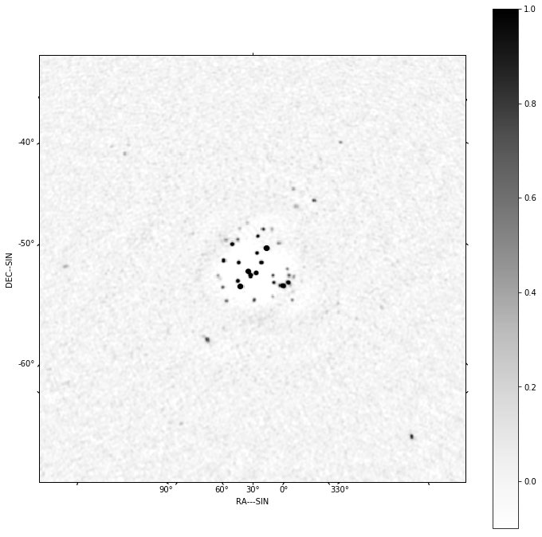

.. parsed-literal::

    WARNING: FITSFixedWarning: The WCS transformation has more axes (4) than the image it is associated with (0) [astropy.wcs.wcs]
    WARNING:astropy:FITSFixedWarning: The WCS transformation has more axes (4) than the image it is associated with (0)

.. parsed-literal::

    arlexecute.compute: Execution using Dask took 28.314 seconds

.. image:: imaging-pipelines_files/imaging-pipelines_15_5.png

Now deconvolve using msclean

.. code:: ipython3

    log.info('About to run deconvolve')
    
    deconvolve_list, _ = \
        deconvolve_component(dirty_list, psf_list, model_imagelist=model_list, 
                                deconvolve_facets=8, deconvolve_overlap=16, deconvolve_taper='tukey',
                                scales=[0, 3, 10],
                                algorithm='msclean', niter=1000, 
                                fractional_threshold=0.1,
                                threshold=0.1, gain=0.1, psf_support=64)
        
    deconvolved = arlexecute.compute(deconvolve_list, sync=True)
    show_image(deconvolved[0], cm='Greys', vmax=0.1, vmin=-0.01)
    plt.show()

.. parsed-literal::

    WARNING: FITSFixedWarning: The WCS transformation has more axes (4) than the image it is associated with (0) [astropy.wcs.wcs]
    WARNING:astropy:FITSFixedWarning: The WCS transformation has more axes (4) than the image it is associated with (0)

.. parsed-literal::

    arlexecute.compute: Execution using Dask took 5.968 seconds

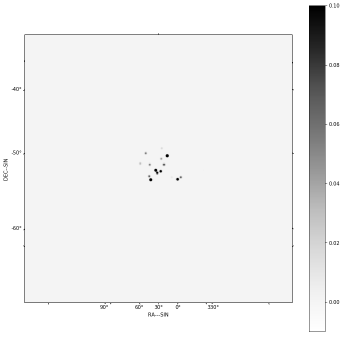

.. code:: ipython3

    continuum_imaging_list = \
        continuum_imaging_component(future_predicted_vislist, 
                                                model_imagelist=model_list, 
                                                context='wstack', vis_slices=vis_slices, 
                                                scales=[0, 3, 10], algorithm='mmclean', 
                                                nmoment=3, niter=1000, 
                                                fractional_threshold=0.1,
                                                threshold=0.1, nmajor=5, gain=0.25,
                                                deconvolve_facets = 8, deconvolve_overlap=16, 
                                                deconvolve_taper='tukey', psf_support=64)

.. code:: ipython3

    log.info('About to run continuum imaging')
    
    result=arlexecute.compute(continuum_imaging_list, sync=True)
    deconvolved = result[0][0]
    residual = result[1][0]
    restored = result[2][0]
    
    f=show_image(deconvolved, title='Clean image - no selfcal', cm='Greys', 
                 vmax=0.1, vmin=-0.01)
    print(qa_image(deconvolved, context='Clean image - no selfcal'))
    
    plt.show()
    
    f=show_image(restored, title='Restored clean image - no selfcal', 
                 cm='Greys', vmax=1.0, vmin=-0.1)
    print(qa_image(restored, context='Restored clean image - no selfcal'))
    plt.show()
    export_image_to_fits(restored, '%s/imaging-dask_continuum_imaging_restored.fits' 
                         %(results_dir))
    
    f=show_image(residual[0], title='Residual clean image - no selfcal', cm='Greys', 
                 vmax=0.1, vmin=-0.01)
    print(qa_image(residual[0], context='Residual clean image - no selfcal'))
    plt.show()
    export_image_to_fits(residual[0], '%s/imaging-dask_continuum_imaging_residual.fits' 
                         %(results_dir))

.. parsed-literal::

    WARNING: FITSFixedWarning: The WCS transformation has more axes (4) than the image it is associated with (0) [astropy.wcs.wcs]
    WARNING:astropy:FITSFixedWarning: The WCS transformation has more axes (4) than the image it is associated with (0)

.. parsed-literal::

    arlexecute.compute: Execution using Dask took 680.607 seconds
    Quality assessment:
    	Origin: qa_image
    	Context: Clean image - no selfcal
    	Data:
    		shape: '(1, 1, 512, 512)'
    		max: '6.675185037447525'
    		min: '-0.10168339898385434'
    		rms: '0.02335961498987907'
    		sum: '62.606191422801864'
    		medianabs: '0.0'
    		median: '0.0'
    

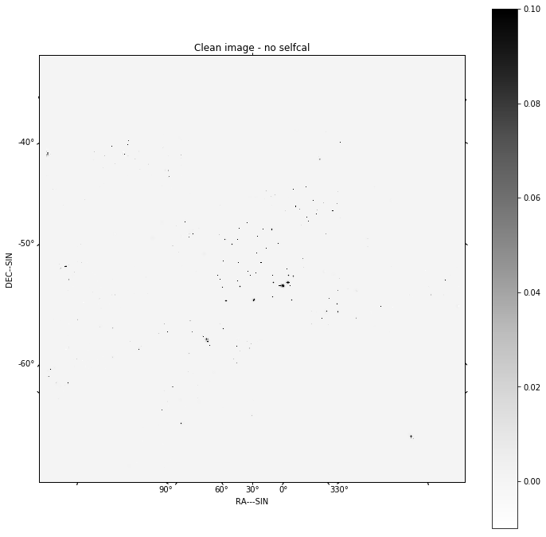

.. parsed-literal::

    Quality assessment:
    	Origin: qa_image
    	Context: Restored clean image - no selfcal
    	Data:
    		shape: '(1, 1, 512, 512)'
    		max: '6.714973742498582'
    		min: '-0.016778439330933103'
    		rms: '0.07856755216023087'
    		sum: '1236.27112844747'
    		medianabs: '0.0024952848587235866'
    		median: '-0.00034297989048100413'
    

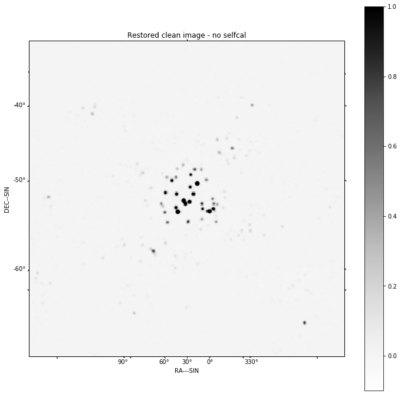

.. parsed-literal::

    Quality assessment:
    	Origin: qa_image
    	Context: Residual clean image - no selfcal
    	Data:
    		shape: '(1, 1, 512, 512)'
    		max: '0.22053098445062588'
    		min: '-0.09142264270959863'
    		rms: '0.0063371487248985265'
    		sum: '14.16860864309809'
    		medianabs: '0.0024588129356244892'
    		median: '-0.00048672738645994646'
    

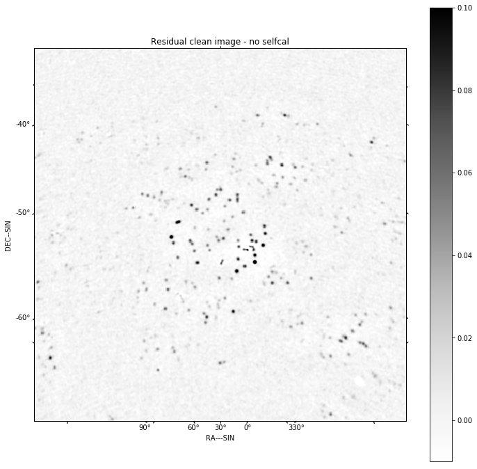

.. code:: ipython3

    for chan in range(nfreqwin):
        residual = result[1][chan]
        show_image(residual[0], title='Channel %d' % chan, cm='Greys', 
                   vmax=0.1, vmin=-0.01)
        plt.show()

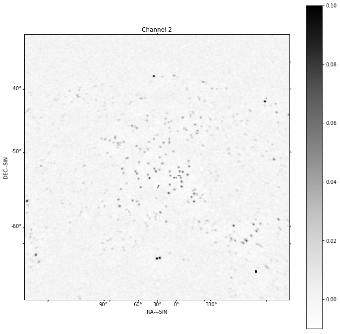

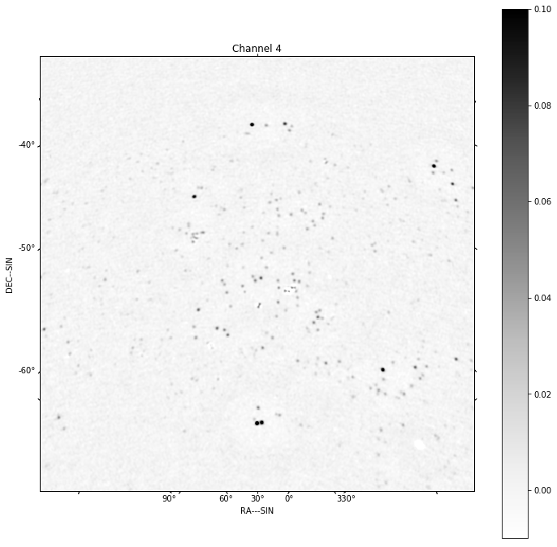

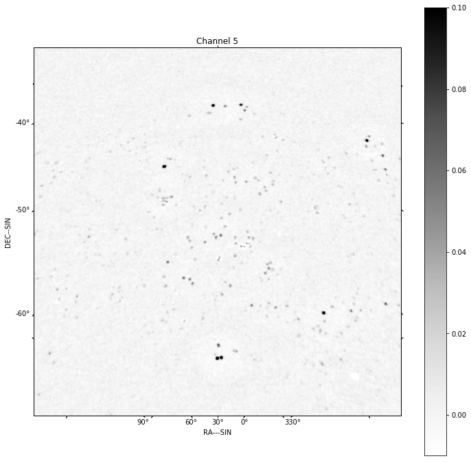

.. code:: ipython3

    controls = create_calibration_controls()
            
    controls['T']['first_selfcal'] = 1
    controls['G']['first_selfcal'] = 3
    controls['B']['first_selfcal'] = 4
    
    controls['T']['timescale'] = 'auto'
    controls['G']['timescale'] = 'auto'
    controls['B']['timescale'] = 1e5
    
    pp.pprint(controls)

.. parsed-literal::

    {'B': {'first_selfcal': 4,
           'phase_only': False,
           'shape': 'vector',
           'timescale': 100000.0,
           'timeslice': 100000.0},
     'G': {'first_selfcal': 3,
           'phase_only': False,
           'shape': 'vector',
           'timescale': 'auto',
           'timeslice': 60.0},
     'I': {'first_selfcal': 0,
           'phase_only': True,
           'shape': 'vector',
           'timeslice': 1.0},
     'P': {'first_selfcal': 0,
           'phase_only': False,
           'shape': 'matrix',
           'timeslice': 10000.0},
     'T': {'first_selfcal': 1,
           'phase_only': True,
           'shape': 'scalar',
           'timescale': 'auto',
           'timeslice': 'auto'}}

.. code:: ipython3

    future_corrupted_vislist = arlexecute.scatter(corrupted_vislist)
    ical_list = ical_component(future_corrupted_vislist, 
                                            model_imagelist=model_list,  
                                            context='wstack', 
                                            calibration_context = 'TG', 
                                            controls=controls,
                                            scales=[0, 3, 10], algorithm='mmclean', 
                                            nmoment=3, niter=1000, 
                                            fractional_threshold=0.1,
                                            threshold=0.1, nmajor=5, gain=0.25,
                                            deconvolve_facets = 8, 
                                            deconvolve_overlap=16,
                                            deconvolve_taper='tukey',
                                            vis_slices=ntimes,
                                            timeslice='auto',
                                            global_solution=False, 
                                            psf_support=64,
                                            do_selfcal=True)

.. code:: ipython3

    log.info('About to run ical')
    result=arlexecute.compute(ical_list, sync=True)
    deconvolved = result[0][0]
    residual = result[1][0]
    restored = result[2][0]
    
    f=show_image(deconvolved, title='Clean image', cm='Greys', vmax=1.0, vmin=-0.1)
    print(qa_image(deconvolved, context='Clean image'))
    plt.show()
    
    f=show_image(restored, title='Restored clean image', cm='Greys', vmax=1.0, 
                 vmin=-0.1)
    print(qa_image(restored, context='Restored clean image'))
    plt.show()
    export_image_to_fits(restored, '%s/imaging-dask_ical_restored.fits' 
                         %(results_dir))
    
    f=show_image(residual[0], title='Residual clean image', cm='Greys', 
                 vmax=0.1, vmin=-0.01)
    print(qa_image(residual[0], context='Residual clean image'))
    plt.show()
    export_image_to_fits(residual[0], '%s/imaging-dask_ical_residual.fits' 
                         %(results_dir))

.. parsed-literal::

    WARNING: FITSFixedWarning: The WCS transformation has more axes (4) than the image it is associated with (0) [astropy.wcs.wcs]
    WARNING:astropy:FITSFixedWarning: The WCS transformation has more axes (4) than the image it is associated with (0)

.. parsed-literal::

    arlexecute.compute: Execution using Dask took 200.569 seconds
    Quality assessment:
    	Origin: qa_image
    	Context: Clean image
    	Data:
    		shape: '(1, 1, 512, 512)'
    		max: '6.592696037713692'
    		min: '-0.061162715821037855'
    		rms: '0.023186121206391363'
    		sum: '55.36661509106878'
    		medianabs: '0.0'
    		median: '0.0'
    

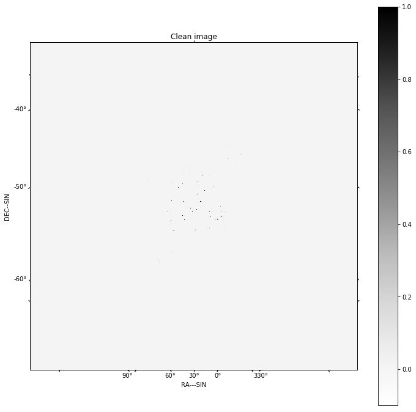

.. parsed-literal::

    Quality assessment:
    	Origin: qa_image
    	Context: Restored clean image
    	Data:
    		shape: '(1, 1, 512, 512)'
    		max: '6.709721399187302'
    		min: '-0.11764454341668781'
    		rms: '0.07826258586629802'
    		sum: '1082.790074347177'
    		medianabs: '0.004703169341210313'
    		median: '4.53628689530118e-05'
    

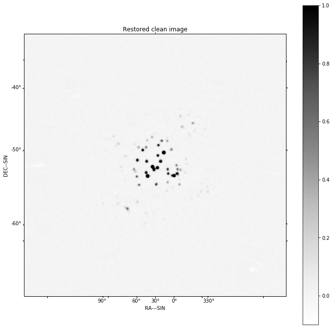

.. parsed-literal::

    Quality assessment:
    	Origin: qa_image
    	Context: Residual clean image
    	Data:
    		shape: '(1, 1, 512, 512)'
    		max: '0.16496988664008733'
    		min: '-0.08628806402928851'
    		rms: '0.00793606279974757'
    		sum: '2.008206742358009'
    		medianabs: '0.004658655975026467'
    		median: '-7.33221120101648e-05'
    

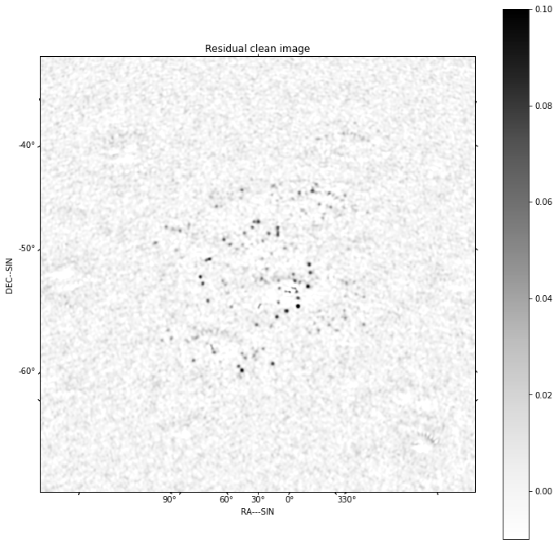

.. code:: ipython3

    arlexecute.close()

.. parsed-literal::

    arlexcute.close: closing down Dask Client

